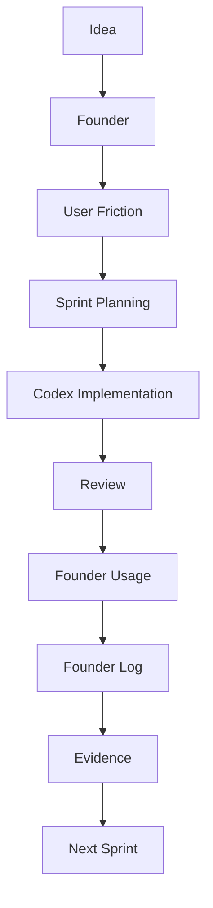

# Product Development Playbook

Version: 1.0

Last Updated: 2026-07-02

Status: Active

이 문서는 MyOTT에서 정립한 제품 운영 방식을 정리한 Playbook입니다. 향후 Nd_core의 다른 Product에서도 재사용할 수 있는 기준 문서로 관리합니다.

---

## 1. Purpose

이 문서는 제품을 만드는 방법이 아니라 제품을 운영하는 방법을 정의합니다.

목표:

- Sprint가 왜 시작되는지 명확히 한다.
- Founder, CPM, CTO, Codex의 역할을 분리한다.
- User Friction과 Evidence를 기준으로 다음 작업을 결정한다.
- 기능 수보다 사용자의 시간을 얼마나 줄였는지에 집중한다.

---

## 2. Product Philosophy

우리는 기능을 추가하며 성장하는 제품이 아니라, 사용자의 망설임을 하나씩 제거하며 성장하는 제품을 만든다.

핵심 관점:

- Recommendation is a means.
- Decision is the goal.
- AI는 사용자 앞에서 과시되는 기능이 아니라 뒤에서 결정을 돕는 엔진이다.
- 모든 클릭과 문구는 사용자의 시간을 줄이는 이유를 가져야 한다.

---

## 3. Company Mission

우리는 사람들이 좋은 작품을 찾는 시간을 줄이고, 좋은 작품을 즐기는 시간을 늘린다.

---

## 4. Team Roles

| Role | Responsibility | First Question |
| --- | --- | --- |
| Founder | 제품 방향, 우선순위, 최종 의사결정, 실사용 검증 | 사용자는 어디에서 망설이는가? |
| CPM | Sprint 목표, User Friction, Product Impact, Review 정리 | 지금 해결해야 할 가장 큰 User Friction은 무엇인가? |
| CTO | 아키텍처, 유지보수성, 기술 부채, 장기 확장성 판단 | 이 구조는 장기적으로 유지 가능한가? |
| Codex | 구현, 리팩토링, 로컬 검증, 문서 반영, Git 작업 | 가장 안전하게 구현하는 방법은 무엇인가? |

---

## 5. Sprint Workflow

운영 원칙:

- Sprint는 아이디어가 아니라 User Friction에서 시작한다.
- Review는 완료 보고가 아니라 다음 판단을 위한 증거 정리다.
- Founder Log는 감상이 아니라 실제 사용 관찰을 남긴다.

---

## 6. Sprint Start Checklist

- [ ] User Friction 정의
- [ ] Evidence 확인
- [ ] Cost of Delay 확인
- [ ] Sprint Goal 작성
- [ ] Feature Budget 확인
- [ ] Token Budget 확인
- [ ] Out of Scope 명시
- [ ] Definition of Done 작성

---

## 7. Sprint End Checklist

- [ ] Local Test
- [ ] Founder Review
- [ ] CPM Review
- [ ] CTO Review
- [ ] Dashboard Update
- [ ] Founder Log 준비
- [ ] Known Issues 기록
- [ ] Technical Debt 기록
- [ ] Commit / Push

---

## 8. Sprint Review Rules

Sprint Review에는 항상 아래 항목을 포함합니다.

| Item | Purpose |
| --- | --- |
| Product Impact | 사용자에게 무엇이 좋아졌는지 확인 |
| User Experience Summary | 사용 흐름이 어떻게 바뀌었는지 정리 |
| Known Issues | 아직 남은 문제를 숨기지 않음 |
| Technical Debt | 뒤로 미룬 구조적 비용을 기록 |

Review는 칭찬이나 보고서가 아니라 다음 Sprint를 더 정확히 시작하기 위한 재료입니다.

---

## 9. Product Development Principles

- User Friction First
- Recommendation is a means, Decision is the goal
- AI는 숨겨진 엔진이다.
- 모든 클릭은 이유가 있어야 한다.
- 기능보다 사용자의 시간을 줄인다.
- Sprint Goal이 Task보다 중요하다.
- Evidence 기반으로 Sprint를 시작한다.
- Feature Budget을 유지한다.
- Cost of Delay를 고려한다.
- Documentation First
- Architecture First
- Privacy by Design
- Parking Lot으로 MVP를 보호한다.

### Recommendation Engine Principle

- 추천 엔진은 더 많은 결과를 보여주기 위한 기능이 아니다.
- 추천 엔진의 목적은 사용자가 가장 먼저 볼 작품을 더 빨리 찾도록 돕는 것이다.
- 추천 결과는 입력 작품, 추천 옵션, metadata, 공통점, 신뢰 단서를 바탕으로 정렬되어야 한다.
- 좋은 추천은 결과 수를 늘리는 것이 아니라 첫 번째 선택의 품질을 높이는 것이다.
- 추천 로직은 가능한 한 설명 가능해야 한다.
- 글로벌 서비스를 고려하여 추천 로직은 표시 언어보다 TMDB genre id 같은 locale-independent metadata를 우선 활용한다.

---

## 10. Documentation Rules

| Document | Role | Update Timing |
| --- | --- | --- |
| `PROJECT_STATUS.md` | 개발 진행 관리의 Source of Truth | Sprint/Task 상태 변경 시 |
| `PRODUCT_DASHBOARD.md` | Founder 운영 대시보드 | Sprint 종료 또는 Founder Review 후 |
| `FOUNDER_LOG.md` | 실사용 관찰 과정 기록 | Founder 실사용 직후 |
| `PLAYBOOK.md` | 제품 운영 방식과 팀 문화 기준 | 운영 원칙이 명확히 정립될 때 |

문서 역할 분리:

- Status는 현재 위치를 말한다.
- Dashboard는 현재 판단을 말한다.
- Founder Log는 판단의 근거를 말한다.
- Playbook은 일하는 방식을 말한다.

---

## 11. Parking Lot Rules

Parking Lot으로 보내는 경우:

- MVP 출시를 늦춘다.
- 현재 Sprint Goal과 직접 연결되지 않는다.
- 좋은 아이디어지만 Evidence가 부족하다.
- 기술 부채나 범위 확장을 만든다.
- 한 달 뒤에 만들어도 사용자 가치가 크게 줄지 않는다.

Sprint에 넣는 경우:

- 현재 User Friction을 직접 줄인다.
- Cost of Delay가 크다.
- MVP 신뢰도나 사용 흐름을 막고 있다.
- Founder Review에서 반복적으로 관찰된 문제다.

---

## 12. Sprint Exit Question

Sprint 종료 전 반드시 묻습니다.

- Sprint Goal을 달성했는가?
- 사용자의 시간이 실제로 줄었는가?
- 아직 남은 작은 마찰이 있는가?
- 다음 Sprint로 넘길 Technical Debt는 무엇인가?
- Parking Lot으로 보내야 할 좋은 아이디어는 무엇인가?
- Founder Log에 남길 Evidence가 있는가?

---

## 13. Decision Rules

새 기능을 Sprint에 넣기 전 확인합니다.

| Question | YES | NO |
| --- | --- | --- |
| 이 기능이 현재 User Friction을 직접 줄이는가? | Sprint 후보 | Backlog 또는 Parking Lot |
| 이 기능을 한 달 뒤에 만들어도 괜찮은가? | Backlog | Sprint 후보 |
| 이 기능이 Sprint Goal을 흐리는가? | Parking Lot | 검토 계속 |
| 이 기능이 장기 유지보수를 해치는가? | 재설계 | 검토 계속 |

기준:

- YES to "한 달 뒤도 괜찮다" → Backlog
- NO to "한 달 뒤도 괜찮다" → Sprint 후보

---

## 14. Success Definition

기능 수: ❌

사용자의 시간을 얼마나 되찾아 주었는가: ✅

현재 성공 기준:

- 사용자가 더 빨리 이해한다.
- 사용자가 더 적게 망설인다.
- 사용자가 더 쉽게 선택한다.
- 팀은 더 적은 혼란으로 다음 Sprint를 시작한다.

---

## Changelog

### v1.0

- Initial Playbook
- Sprint Workflow
- Team Roles
- Product Principles
- Documentation Rules
- Recommendation Engine Principle
