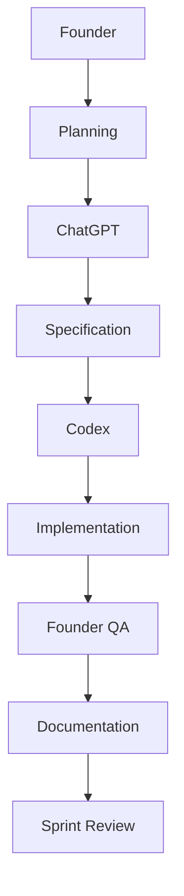

# AI Collaboration

Version: 1.0

Last Updated: 2026-07-04

Status: ACTIVE

이 문서는 MyOTT에서 Founder, ChatGPT, Codex, CTO, 그리고 향후 추가될 AI 도구가 같은 Workflow로 협업하기 위한 기준을 정의합니다.

---

## 1. Purpose

AI 협업의 목적은 더 많은 작업을 빠르게 밀어붙이는 것이 아니라, 같은 기준으로 제품을 판단하고 장기적으로 유지 가능한 결과를 만드는 것입니다.

목표:

- Founder의 제품 의도를 명확한 작업 단위로 전달한다.
- ChatGPT와 Codex가 같은 Sprint 목표와 검증 기준을 공유한다.
- CTO 관점의 구조 판단을 Prompt와 Review에 반영한다.
- 새 AI 도구가 추가되어도 동일한 Workflow를 유지한다.
- 결정, 구현, QA, 문서화가 끊기지 않게 한다.

---

## 2. Role Definition

| Role | Primary Role | First Question |
| --- | --- | --- |
| Founder | 제품 방향, 우선순위, 최종 QA | 사용자는 어디에서 망설이는가? |
| ChatGPT | 기획, 사양 정리, Prompt 작성, Review 보조 | 이 문제를 어떤 Task로 정의해야 하는가? |
| Codex | 구현, 로컬 검증, 문서 반영, Git 작업 | 기존 구조를 깨지 않고 어떻게 반영할 수 있는가? |
| CTO | 아키텍처, 확장성, 기술 부채 판단 | 이 결정은 장기 유지보수에 안전한가? |
| Future AI | 정해진 Workflow 안에서 특정 역할 보조 | 현재 문서 기준을 따르고 있는가? |

역할은 겹칠 수 있지만 최종 책임은 분리합니다. Founder는 제품 결정을, Codex는 저장소 변경을, ChatGPT는 사고 정리와 사양화를, CTO는 구조 판단을 우선합니다.

---

## 3. Standard Workflow

Workflow 설명:

1. Founder가 User Friction, Evidence, 목표를 제시한다.
2. ChatGPT가 목표를 Sprint/Task/Prompt로 구조화한다.
3. Codex가 현재 저장소 상태와 기존 패턴을 확인한다.
4. Codex가 구현 또는 문서 작업을 수행한다.
5. Codex가 build, dev, browser/API smoke, diff check 등 가능한 검증을 수행한다.
6. Founder가 로컬 환경에서 제품 감각과 실제 QA를 확인한다.
7. 결과와 교훈을 운영 문서에 남긴다.
8. Sprint Review에서 다음 작업의 Evidence로 사용한다.

---

## 4. Responsibility

| Role | Responsibility |
| --- | --- |
| Founder | Product Mission, Sprint Goal, Prioritization, Founder QA, final acceptance |
| ChatGPT | Problem framing, Prompt drafting, Specification, Review language, trade-off explanation |
| Codex | Repository inspection, implementation, verification, documentation update, commit/push |
| CTO | Architecture Review, Technical Debt control, Provider/API/DB boundary decisions |
| Future AI | Assigned support work inside the same Prompt Guide and Playbook rules |

책임 원칙:

- Founder의 QA가 Codex의 PASS보다 우선합니다.
- ChatGPT는 구현을 직접 대체하지 않고 사양과 판단을 선명하게 만듭니다.
- Codex는 설계 없는 변경을 피하고 기존 패턴을 먼저 찾습니다.
- CTO 관점은 속도보다 유지보수성과 확장성을 우선합니다.

---

## 5. QA Process

### Founder QA

- 실제 로컬 환경에서 제품을 사용한다.
- User Friction이 줄었는지 확인한다.
- 화면 흐름, 문구, 신뢰감, 사용 속도를 판단한다.
- 실패 사례는 다음 Task의 Evidence로 기록한다.

### Codex QA

- 작업 전 `git status`와 관련 파일을 확인한다.
- 변경 후 `pnpm build`, `pnpm dev`, API/browser smoke 등 가능한 검증을 수행한다.
- `git diff --check`로 whitespace와 patch 품질을 확인한다.
- known limitation을 숨기지 않고 완료 보고에 남긴다.

### Documentation QA

- Markdown 구조와 heading을 확인한다.
- Version과 Status를 확인한다.
- 기존 문서와 역할이 충돌하지 않는지 확인한다.
- 새 결정이나 교훈은 적절한 문서에 남긴다.

---

## 6. Escalation

| 상황 | 결정권자 | 처리 방식 |
| --- | --- | --- |
| Product direction conflict | Founder | 사용자 가치와 MVP 목표 기준으로 결정 |
| Architecture risk | CTO | 구조 대안과 technical debt를 설명 후 결정 |
| Prompt ambiguity | ChatGPT / Founder | Task scope와 Definition of Done을 재정의 |
| Implementation blocker | Codex | 원인, 시도한 방법, 남은 선택지를 보고 |
| Founder QA failure | Founder | 실패 Evidence를 남기고 후속 Task 생성 |
| Security or public/private boundary | Founder / CTO | 노출 범위와 repository authority 기준으로 결정 |

Escalation 원칙:

- 결정권자가 명확해야 작업이 흔들리지 않는다.
- 반대 의견은 근거와 대안을 함께 제시한다.
- 불확실성은 숨기지 않고 Known Issues에 남긴다.

---

## 7. Future AI

향후 아래 AI 도구가 추가되어도 같은 Workflow를 사용합니다.

- Claude
- Gemini
- Cursor
- Copilot
- Future internal AI agents

Future AI 적용 규칙:

- `PROMPT_GUIDE.md`의 Prompt Template을 따른다.
- `PLAYBOOK.md`의 Product 운영 원칙을 따른다.
- `PROJECT_MEMORY.md`의 결정 기록을 먼저 확인한다.
- `LESSONS_LEARNED.md`의 preventive rule을 회귀 방지 기준으로 사용한다.
- 도구가 달라져도 Founder QA와 Documentation Update 기준은 유지한다.

---

## Related Documents

- `PLAYBOOK.md`: 제품 운영 방식과 팀 문화 기준
- `docs/project/PROMPT_GUIDE.md`: Prompt 작성과 검증 표준
- `docs/project/PROJECT_MEMORY.md`: 중요한 결정과 원칙의 기억
- `docs/project/LESSONS_LEARNED.md`: 실패와 교훈, 예방 규칙
