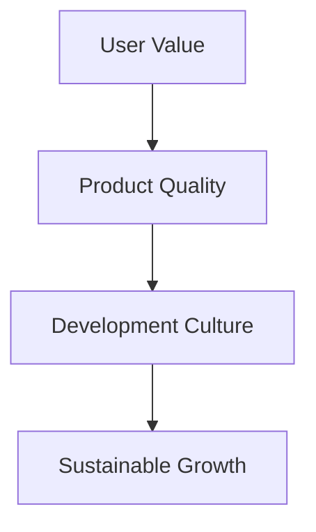
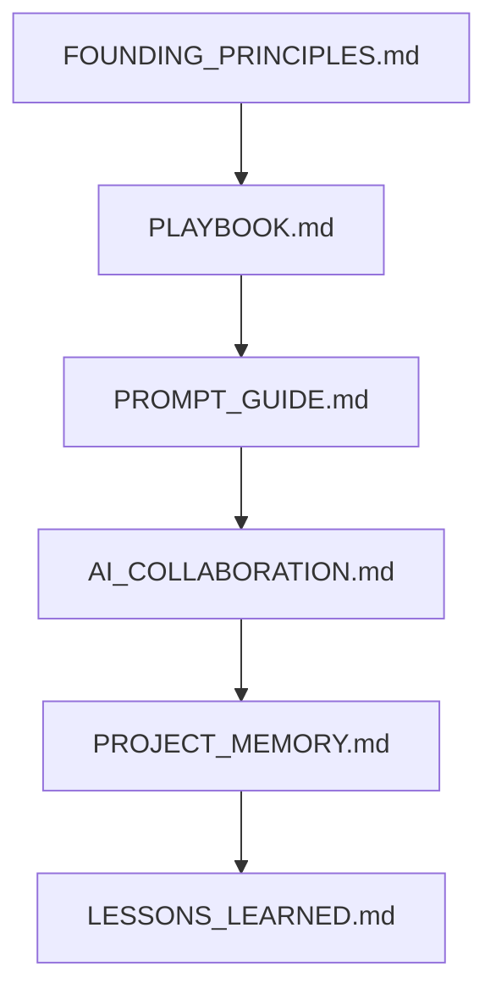

# Founding Principles

Version: 1.0

Last Updated: 2026-07-04

Status: ACTIVE

이 문서는 MyOTT의 최상위 철학을 정의합니다. 운영 절차나 Prompt 작성법이 아니라, MyOTT가 왜 존재하고 어떤 기준으로 제품과 개발 문화를 선택하는지 설명하는 Company Constitution입니다.

---

## Table of Contents

- [1. Company Vision](#1-company-vision)
- [2. Mission](#2-mission)
- [3. North Star](#3-north-star)
- [4. Founding Principles](#4-founding-principles)
- [5. Core Values](#5-core-values)
- [6. Decision Framework](#6-decision-framework)
- [7. Company Assets](#7-company-assets)
- [8. Relationship Map](#8-relationship-map)
- [9. Future Expansion](#9-future-expansion)
- [10. Review Rule](#10-review-rule)

---

## 1. Company Vision

MyOTT의 목표는 단순히 좋은 서비스를 하나 만드는 것이 아닙니다.

우리는 다른 기업들이 "저 회사처럼 만들고 싶다."라고 느낄 수 있는 제품, 개발 문화, AI 협업 문화, 운영 체계를 함께 만듭니다.

MyOTT는 콘텐츠 추천 서비스이면서 동시에 AI와 함께 제품을 만드는 방식의 기준을 실험하고 축적하는 프로젝트입니다. 제품의 완성도와 일하는 방식의 완성도는 분리되지 않습니다.

---

## 2. Mission

MyOTT는 사용자가 보고 싶은 콘텐츠를 가장 쉽고 가장 신뢰할 수 있게 발견하도록 돕습니다.

우리는 더 많은 결과를 보여주는 것이 아니라, 사용자가 더 적은 망설임으로 좋은 선택에 도달하게 만드는 것을 목표로 합니다.

---

## 3. North Star

모든 의사결정은 아래 순서를 기준으로 판단합니다.

| Priority | Standard | Meaning |
| --- | --- | --- |
| 1 | User Value | 사용자의 시간을 줄이고 더 나은 선택을 돕는가 |
| 2 | Product Quality | 신뢰할 수 있고 자연스러운 제품 경험을 만드는가 |
| 3 | Development Culture | 같은 기준으로 반복 가능한 작업 방식을 남기는가 |
| 4 | Sustainable Growth | 장기 유지보수와 확장에 도움이 되는가 |

---

## 4. Founding Principles

| Principle | Description |
| --- | --- |
| Product First | 기능 수보다 사용자가 실제로 느끼는 제품 가치를 우선합니다. |
| Global First | 국가, 언어, locale, AI 도구가 바뀌어도 유지되는 구조와 표현을 선호합니다. |
| Consistency First | 같은 성격의 UI, 문서, Workflow는 같은 규칙을 사용합니다. 예외보다 재사용을 우선합니다. |
| Founder First | 최종 제품 판단은 Founder의 실제 사용 경험과 QA를 기준으로 합니다. |
| Documentation First | 중요한 결정, 규칙, 교훈은 문서로 남깁니다. 문서는 코드만큼 중요한 자산입니다. |
| AI Collaboration First | AI는 단순 실행 도구가 아니라 Founder, ChatGPT, Codex, CTO와 함께 일하는 협업 체계의 일부입니다. |
| Quality Before Speed | 빠른 완료보다 회귀 없는 품질과 신뢰 가능한 결과를 우선합니다. |
| Build Assets | 코드, Prompt, 문서, Workflow, 교훈을 일회성 산출물이 아니라 회사 자산으로 축적합니다. |
| Continuous Improvement | 실패와 마찰을 숨기지 않고 다음 Sprint의 기준으로 개선합니다. |

---

## 5. Core Values

MyOTT가 중요하게 생각하는 가치는 다음과 같습니다.

| Value | Meaning |
| --- | --- |
| 사용자 신뢰 | 추천 결과와 문구가 과장되지 않고 실제 근거를 가져야 합니다. |
| 품질 | 사용자가 보는 화면과 내부 구조 모두 일정한 기준을 만족해야 합니다. |
| 정직 | 아직 실제 데이터가 없는 것은 실제처럼 표현하지 않습니다. |
| 일관성 | 비슷한 문제에는 비슷한 해결 방식을 적용합니다. |
| 확장성 | 현재 Sprint를 넘어서 다음 제품과 다른 AI 도구에도 이어질 수 있어야 합니다. |
| 장기 유지보수 | 오늘 빠른 해결보다 내일 이해 가능한 구조를 선택합니다. |

---

## 6. Decision Framework

충돌이 발생하면 아래 우선순위를 따릅니다.

1. 사용자 가치
2. 품질
3. 일관성
4. 속도
5. 편의성
6. 신규 기능

예시:

- 빠르게 새 기능을 만들 수 있어도 기존 UX 신뢰를 깨면 진행하지 않습니다.
- 보기 좋은 문구라도 실제 데이터 근거가 없으면 사용하지 않습니다.
- 한 영역에만 적용되는 예외 규칙보다 전체 제품에 적용 가능한 공통 규칙을 우선합니다.

---

## 7. Company Assets

MyOTT는 아래 항목을 회사 자산으로 관리합니다.

| Asset | Role |
| --- | --- |
| Code | 제품을 실제로 동작하게 하는 구현 자산 |
| Prompt | Founder의 의도와 작업 기준을 AI가 실행 가능한 형태로 전달하는 운영 자산 |
| Documentation | 결정, 구조, 상태, 원칙을 유지하는 기억 자산 |
| Workflow | Sprint, QA, Review, Commit, Push를 반복 가능하게 만드는 실행 자산 |
| Architecture | 장기 유지보수와 확장을 가능하게 하는 구조 자산 |
| Lessons Learned | 실패와 버그를 재발 방지 규칙으로 바꾸는 학습 자산 |
| Project Memory | 중요한 결정과 철학을 Sprint 이후에도 이어지게 하는 기억 자산 |
| AI Collaboration | Founder, ChatGPT, Codex, CTO, Future AI가 같은 기준으로 협업하게 하는 문화 자산 |

---

## 8. Relationship Map

| Document | Role |
| --- | --- |
| `FOUNDING_PRINCIPLES.md` | MyOTT의 최상위 철학, Vision, Mission, 의사결정 기준 |
| `PLAYBOOK.md` | 제품을 운영하고 Sprint를 진행하는 방식 |
| `PROMPT_GUIDE.md` | Task Prompt 작성과 AI 작업 지시의 표준 |
| `AI_COLLABORATION.md` | Founder, ChatGPT, Codex, CTO, Future AI의 협업 방식 |
| `PROJECT_MEMORY.md` | 장기적으로 기억해야 할 결정, 철학, 원칙 |
| `LESSONS_LEARNED.md` | 실패, 원인, 해결책, 예방 규칙 |

역할 기준:

- `FOUNDING_PRINCIPLES.md`는 왜 이 기준을 따르는지 설명합니다.
- `PLAYBOOK.md`는 어떻게 일하는지 설명합니다.
- `PROMPT_GUIDE.md`는 어떻게 작업을 지시하는지 설명합니다.
- `AI_COLLABORATION.md`는 누가 어떤 역할을 하는지 설명합니다.
- `PROJECT_MEMORY.md`는 무엇을 기억해야 하는지 기록합니다.
- `LESSONS_LEARNED.md`는 무엇을 반복하지 않을지 기록합니다.

---

## 9. Future Expansion

향후 필요에 따라 아래 문서를 추가할 수 있습니다.

| Candidate | Purpose |
| --- | --- |
| `ADR.md` 또는 `docs/adr/` | 중요한 아키텍처 결정 기록 |
| `API_GUIDE.md` | API 설계와 변경 기준 |
| `ARCHITECTURE.md` | 전체 시스템 구조와 경계 |
| `DATABASE_GUIDE.md` | 데이터 모델링과 저장소 운영 기준 |
| `SECURITY_GUIDE.md` | 보안, 개인정보, 공개 저장소 기준 |
| `DEPLOYMENT_GUIDE.md` | 배포, 환경변수, 운영 절차 |
| `PRODUCT_VISION.md` | 제품 비전과 장기 Roadmap |

추가 원칙:

- 새 문서는 기존 문서의 책임을 대체하지 않아야 합니다.
- 새 문서는 반복되는 문제를 줄이거나 의사결정을 더 명확하게 만들 때만 추가합니다.
- 문서도 유지보수 비용이 있으므로 필요 이상의 문서 증식은 피합니다.

---

## 10. Review Rule

이 문서를 수정할 때는 다음 질문을 확인합니다.

- MyOTT의 최상위 철학을 바꾸는 내용인가?
- 특정 Task나 Sprint가 아니라 장기 의사결정 기준에 해당하는가?
- 글로벌 팀과 다른 AI 도구에서도 이해 가능한 표현인가?
- `PLAYBOOK.md`, `PROMPT_GUIDE.md`, `AI_COLLABORATION.md`, `PROJECT_MEMORY.md`, `LESSONS_LEARNED.md`와 역할이 겹치지 않는가?

위 기준을 만족하지 않는 내용은 하위 운영 문서에 기록합니다.
