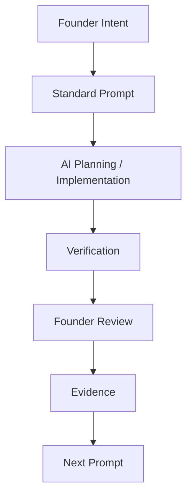

# Prompt Guide

Version: 1.0

Last Updated: 2026-07-04

Status: ACTIVE

이 문서는 MyOTT의 Prompt Engineering 표준을 정의합니다. Prompt는 단순 작업 지시가 아니라 Founder, ChatGPT, Codex, 그리고 향후 다른 AI 도구가 같은 작업 규칙을 공유하기 위한 Project Asset입니다.

---

## 1. Prompt Philosophy

Prompt를 관리하는 이유:

- Prompt 품질은 Codex 결과 품질을 직접 결정한다.
- 좋은 Prompt는 목표, 범위, 검증 기준, 금지사항을 분리해 작업 실패 가능성을 줄인다.
- Founder의 의도와 제품 철학을 작업 단위로 전달한다.
- 같은 Sprint 안에서 ChatGPT, Codex, Founder가 같은 기준으로 판단하게 한다.
- Prompt도 코드처럼 version을 관리하고 개선한다.

Prompt와 제품 품질의 관계:

| Prompt 품질 | 결과 |
| --- | --- |
| 목표가 선명함 | 구현 방향이 흔들리지 않음 |
| Out of Scope가 명확함 | 불필요한 기능 추가 방지 |
| Verification이 구체적임 | QA 실패를 빠르게 발견 |
| Architecture Check 포함 | 기술 부채 증가 방지 |
| Founder Review 포함 | 실제 제품 감각 반영 |

Founder 중심 Workflow:



---

## 2. MYOTT Standard Prompt Template

아래 항목은 MyOTT 공식 Task Prompt의 기본 구조입니다. 모든 항목이 항상 길 필요는 없지만, 생략할 경우 이유가 명확해야 합니다.

```markdown
Task:
<Task ID>

Codex Mode:
낮음 / 보통 / 높음 / 매우높음

Codex Stage:
<현재 작업 단계>

Repository Scope:
<Product / Documentation / Platform / Both>

Sprint:
<Sprint 이름>

Goal:
<이번 Task의 최종 목표>

Priority:
<LOW / MEDIUM / HIGH / CRITICAL>

Out of Scope:
- <이번 Task에서 하지 않을 일>

Global Ready Check:
- i18n / locale / metadata / country / language / label-value 분리 확인

Architecture Check:
- 기존 패턴 재사용
- 중복 코드 방지
- Provider / Component / Hook 구조 유지

Data Quality Gate:
- <데이터 또는 UX 품질 검증 케이스>

Verification:
1. <실행 명령>
2. <브라우저 확인>
3. <콘솔/런타임 확인>

Definition of Done:
- [ ] 구현 또는 문서 작성 완료
- [ ] Verification 완료
- [ ] 문서 업데이트 여부 확인
- [ ] Commit
- [ ] Push

Recommended Commit Message:
<type(scope): message>

완료 보고 형식:
Task:
<Task ID>

Commit:
<hash>

검증 요약:
...

Known Issues:
...
```

---

## 3. Codex Mode

| Mode | 사용 기준 | 기대 행동 |
| --- | --- | --- |
| 낮음 | 문서 수정, 작은 UI polish, 영향 범위가 좁은 작업 | 기존 패턴을 확인하고 최소 변경으로 처리 |
| 보통 | 일반 기능 수정, UX 개선, 제한된 파일 변경 | 구현, 검증, 문서 반영까지 완료 |
| 높음 | Provider, API, 상태 관리, 회귀 위험이 있는 작업 | 구조 확인, 회귀 검증, QA 케이스 중심 진행 |
| 매우높음 | Sprint 마감, 아키텍처 전환, 신뢰도/보안/데이터 품질 핵심 작업 | 기존 구조와 장기 유지보수를 우선하고 검증을 강화 |

Codex Mode는 작업 난이도가 아니라 실패했을 때의 제품 영향도와 검증 강도를 나타냅니다.

---

## 4. Architecture Check

Task Prompt에는 필요한 경우 아래 항목을 포함합니다.

| Check | Rule |
| --- | --- |
| 중복 코드 | 같은 로직을 새로 만들기 전에 기존 helper, component, provider를 찾는다. |
| Component 재사용 | 동일한 성격의 UI는 기존 component나 UX rule을 우선 재사용한다. |
| Hook 분리 | 상태/효과 로직이 커지면 hook 분리를 검토한다. 단, Task 범위 밖 리팩토링은 피한다. |
| `page.jsx` 비대화 방지 | 새 기능이 `page.jsx`에 과도하게 쌓이면 별도 모듈화를 검토한다. |
| Provider Layer 재사용 | TMDB, Mock, future provider는 Provider Interface를 거쳐 접근한다. |
| Technical Debt | 새 변경이 다음 Sprint의 부채를 늘리는지 기록한다. |
| Design System | 기존 색상, 카드, chip, button, spacing 규칙을 유지한다. |
| UX Rule | 더보기/접기, carousel, chip, 검색, responsive rule을 같은 범주에 일관되게 적용한다. |
| 향후 확장성 | locale, metadata, provider, content type 확장을 막지 않는다. |

---

## 5. Global Ready Check

Global Ready는 지금 당장 글로벌 출시를 의미하지 않습니다. 나중에 글로벌 확장이 어려워지지 않도록 기본 구조를 유지하는 기준입니다.

| Area | Rule |
| --- | --- |
| i18n | 화면 문구와 로직을 가능하면 분리한다. |
| Locale | 추천 로직이 한국어 표시 문구에 의존하지 않도록 한다. |
| Metadata | TMDB genre id, provider id, content type 같은 stable metadata를 우선한다. |
| Country | 국가 선택은 country code 기반으로 처리한다. |
| Language | 언어는 language code 기반 확장을 고려한다. |
| Label / Value 분리 | 사용자 표시 label과 내부 value/id를 분리한다. |
| 한국어 하드코딩 최소화 | 표시 문구는 허용하되 scoring/filtering 기준으로 사용하지 않는다. |
| 확장성 | ChatGPT, Codex, Claude, Gemini, Cursor 등 AI 도구가 읽어도 같은 기준으로 해석되어야 한다. |

---

## 6. Consistency First Principle

새로운 UI나 기능을 추가하거나 수정할 때는 같은 성격의 component가 이미 존재하는지 먼저 확인합니다.

Rule:

- 동일한 성격의 UI는 동일한 UX Rule을 사용한다.
- 새로운 예외를 만들기보다 기존 패턴을 재사용하거나 일반화한다.
- 장르, 국가, 배우, 감독, 언어, 제작사 option group은 같은 expand/search/chip rule을 따른다.
- Related Picks 같은 가로 리스트가 있다면 다른 가로 리스트도 같은 carousel/drag/swipe pattern을 우선 사용한다.
- 버튼, chip, card, layer, empty/loading state는 기존 스타일과 행동을 유지한다.

---

## 7. Founder First Principle

최종 QA는 Founder가 판단합니다.

- Codex PASS는 기술적 검증입니다.
- Founder PASS는 제품 검증입니다.
- 로컬 환경에서 Founder가 발견한 마찰은 다음 Prompt의 Evidence가 됩니다.
- Founder Review가 실패하면 Task는 제품 기준으로 완료되지 않은 것으로 봅니다.

---

## 8. Regression Zero Principle

새 기능보다 기존 기능 유지가 우선입니다.

Prompt에는 반드시 기존 기능 유지 항목을 포함합니다.

예:

- Autocomplete 유지
- Quick Pick 유지
- Detail Layer 유지
- Related Picks 유지
- Provider Registry 유지
- Mock fallback 유지
- Console Error 없음

---

## 9. Reuse First Principle

새 component를 만들기 전에 기존 자산을 먼저 찾습니다.

우선순위:

1. 기존 component 재사용
2. 기존 helper 재사용
3. 기존 hook 또는 state pattern 재사용
4. 기존 Provider/API route 재사용
5. 필요한 경우에만 새 abstraction 추가

새 abstraction은 실제 복잡도를 줄일 때만 만듭니다.

---

## 10. Documentation Rule

Task 종료 시 문서 업데이트 여부를 확인합니다.

기본 대상:

- `CHANGELOG.md`
- `docs/project/TASK_HISTORY.md`
- `docs/dev-log.md`

단, Documentation Only 작업에서 기존 문서 수정을 최소화하라는 지시가 있으면 새 문서 생성만 수행할 수 있습니다. 이 경우 완료 보고에 이유를 남깁니다.

---

## 11. Prompt Version Rule

Prompt Guide는 Semantic Versioning을 사용합니다.

| Version | 기준 |
| --- | --- |
| v1.0 | 초기 Prompt 표준화 |
| v1.1 | Minor Rule 추가 |
| v1.2 | Template 개선 |
| v2.0 | Major Workflow 변경 |

Version 변경 기준:

- Patch 수준의 오타 수정은 changelog에만 기록할 수 있다.
- 새 check 항목이나 template 항목 추가는 minor version 후보입니다.
- Sprint 운영 방식 자체가 바뀌면 major version 후보입니다.

---

## 12. Prompt Changelog

### v1.0

- Prompt 표준화
- MYOTT Standard Prompt Template 정의
- Codex Mode 기준 정의
- Architecture Check 추가
- Global Ready Check 추가
- Consistency First / Founder First / Regression Zero / Reuse First 원칙 정리

---

## 13. Future Expansion

Prompt Guide는 Sprint와 함께 발전합니다.

확장 후보:

- Task 유형별 Prompt Template
- UI Polish Prompt Template
- Provider Integration Prompt Template
- QA Bugfix Prompt Template
- Documentation Sprint Prompt Template
- Founder Review 기록 방식
- AI 도구별 실행 차이 정리

목표는 Prompt를 매번 새로 쓰는 것이 아니라, 프로젝트가 배운 규칙을 Prompt Standard로 축적하는 것입니다.
