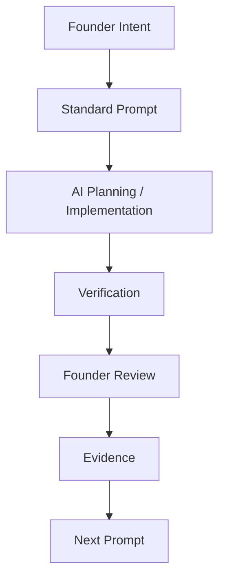

# Prompt Guide

Version: 1.5.1

Last Updated: 2026-07-18

Status: ACTIVE

이 문서는 MyOTT의 Prompt Engineering 표준을 정의합니다. Prompt는 단순 작업 지시가 아니라 Founder, ChatGPT, Codex, 그리고 향후 다른 AI 도구가 같은 작업 규칙을 공유하기 위한 Project Asset입니다.

---

## 1. Prompt Philosophy

Prompt를 관리하는 이유:

- Prompt 품질은 Codex 결과 품질을 직접 결정한다.
- 좋은 Prompt는 목표, 범위, 검증 기준, 금지사항을 분리해 작업 실패 가능성을 줄인다.
- Founder의 의도와 제품 철학을 작업 단위로 전달한다.
- 같은 Sprint 안에서 ChatGPT, Codex, Founder가 같은 기준으로 판단하게 한다.
- Prompt도 코드처럼 version을 관리하고 개선한다.

Prompt와 제품 품질의 관계:

| Prompt 품질 | 결과 |
| --- | --- |
| 목표가 선명함 | 구현 방향이 흔들리지 않음 |
| Out of Scope가 명확함 | 불필요한 기능 추가 방지 |
| Verification이 구체적임 | QA 실패를 빠르게 발견 |
| Architecture Check 포함 | 기술 부채 증가 방지 |
| Founder Review 포함 | 실제 제품 감각 반영 |

Founder 중심 Workflow:



---

## 2. MYOTT Standard Prompt Template

아래 항목은 MyOTT 공식 Task Prompt의 기본 구조입니다. 모든 항목이 항상 길 필요는 없지만, 생략할 경우 이유가 명확해야 합니다.

```markdown
Task:
<Task ID>

Codex Mode:
낮음 / 보통 / 높음 / 매우높음 / 울트라

Codex Mode Reason:
<왜 이 Mode가 필요한지>

Codex Stage:
<현재 작업 단계>

AI Execution Profile:
Platform: <ChatGPT / Codex>
Model: <모델>
Reasoning: <선택한 Platform UI의 reasoning option>
Reason: <이 모델과 reasoning level을 선택한 이유>

Repository Scope:
<Product / Documentation / Platform / Both>

Sprint:
<Sprint 이름>

Goal:
<이번 Task의 최종 목표>

Priority:
<LOW / MEDIUM / HIGH / CRITICAL>

ROI:
사용자 가치: ★★★★☆
추천 품질: ★★★☆☆
기술부채 감소: ★★☆☆☆
문서화: ★☆☆☆☆
신규 기능: 해당 없음

Out of Scope:
- <이번 Task에서 하지 않을 일>

Global Ready Check:
- i18n / locale / metadata / country / language / label-value 분리 확인

Architecture Check:
- 기존 패턴 재사용
- 중복 코드 방지
- Provider / Component / Hook 구조 유지

Data Quality Gate:
- <데이터 또는 UX 품질 검증 케이스>

Codex QA Contract:
- Required QA Layers: <Static / Unit / Deterministic / Live / Browser / Founder>
- Browser Required: <Yes / No와 근거>
- Browser Security Boundary: <허용 Browser, Origin, CDP 범위>
- Evidence Required: <각 Layer의 증거>
- Adversarial Cases: <기본값, null, 충돌, race, reset 등>
- Regression Cases: <유지해야 할 기존 동작>
- Stop-The-Line Conditions: <CRITICAL / MAJOR 차단 조건>
- Founder Review Required: <Yes / No>
- PASS Prohibition: No Evidence, No PASS.
- Final Commit Rerun: <최종 Commit에서 재실행할 항목>

Verification:
1. <실행 명령>
2. <브라우저 확인>
3. <콘솔/런타임 확인>

Definition of Done:
- [ ] 구현 또는 문서 작성 완료
- [ ] Verification 완료
- [ ] 문서 업데이트 여부 확인
- [ ] Commit
- [ ] Push

Recommended Commit Message:
<type(scope): message>

완료 보고 형식:
Task:
<Task ID>

Commit:
<hash>

검증 요약:
...

Known Issues:
...
```

---

## 3. Codex Mode

| Mode | 사용 기준 | 기대 행동 |
| --- | --- | --- |
| 낮음 | 문서 수정, 작은 UI polish, 영향 범위가 좁은 작업 | 기존 패턴을 확인하고 최소 변경으로 처리 |
| 보통 | 일반 기능 수정, UX 개선, 제한된 파일 변경 | 구현, 검증, 문서 반영까지 완료 |
| 높음 | Provider, API, 상태 관리, 회귀 위험이 있는 작업 | 구조 확인, 회귀 검증, QA 케이스 중심 진행 |
| 매우높음 | 추천 엔진, 아키텍처, 운영, 보안, 다중 Module 작업 | 기존 구조와 장기 유지보수를 우선하고 검증을 강화 |
| 울트라 | 회사 핵심 표준, 출시 차단 문제, Production Migration, 복구 비용이 큰 보안·데이터 무결성·전사 재사용 체계 | 모든 QA Layer를 분리하고 증거 계약, adversarial 검증, 최종 Commit 재실행을 적용 |

Codex Mode는 작업 난이도가 아니라 실패했을 때의 제품 영향도와 검증 강도를 나타냅니다.

Codex Mode Reason:

- Mode를 선택한 이유를 한 줄 이상 작성한다.
- 기능 개발이 아니더라도 운영 체계, QA, 보안, 문서 표준처럼 장기 영향이 크면 높은 Mode를 사용할 수 있다.
- Reason은 Codex가 검증 강도와 작업 보수성을 조절하는 기준이 된다.

---

## 4. Architecture Check

Task Prompt에는 필요한 경우 아래 항목을 포함합니다.

| Check | Rule |
| --- | --- |
| 중복 코드 | 같은 로직을 새로 만들기 전에 기존 helper, component, provider를 찾는다. |
| Component 재사용 | 동일한 성격의 UI는 기존 component나 UX rule을 우선 재사용한다. |
| Hook 분리 | 상태/효과 로직이 커지면 hook 분리를 검토한다. 단, Task 범위 밖 리팩토링은 피한다. |
| `page.jsx` 비대화 방지 | 새 기능이 `page.jsx`에 과도하게 쌓이면 별도 모듈화를 검토한다. |
| Provider Layer 재사용 | TMDB, Mock, future provider는 Provider Interface를 거쳐 접근한다. |
| Technical Debt | 새 변경이 다음 Sprint의 부채를 늘리는지 기록한다. |
| Design System | 기존 색상, 카드, chip, button, spacing 규칙을 유지한다. |
| UX Rule | 더보기/접기, carousel, chip, 검색, responsive rule을 같은 범주에 일관되게 적용한다. |
| 향후 확장성 | locale, metadata, provider, content type 확장을 막지 않는다. |

---

## 5. Global Ready Check

Global Ready는 지금 당장 글로벌 출시를 의미하지 않습니다. 나중에 글로벌 확장이 어려워지지 않도록 기본 구조를 유지하는 기준입니다.

| Area | Rule |
| --- | --- |
| i18n | 화면 문구와 로직을 가능하면 분리한다. |
| Locale | 추천 로직이 한국어 표시 문구에 의존하지 않도록 한다. |
| Metadata | TMDB genre id, provider id, content type 같은 stable metadata를 우선한다. |
| Country | 국가 선택은 country code 기반으로 처리한다. |
| Language | 언어는 language code 기반 확장을 고려한다. |
| Label / Value 분리 | 사용자 표시 label과 내부 value/id를 분리한다. |
| 한국어 하드코딩 최소화 | 표시 문구는 허용하되 scoring/filtering 기준으로 사용하지 않는다. |
| 확장성 | ChatGPT, Codex, Claude, Gemini, Cursor 등 AI 도구가 읽어도 같은 기준으로 해석되어야 한다. |

---

## 6. Consistency First Principle

새로운 UI나 기능을 추가하거나 수정할 때는 같은 성격의 component가 이미 존재하는지 먼저 확인합니다.

Rule:

- 동일한 성격의 UI는 동일한 UX Rule을 사용한다.
- 새로운 예외를 만들기보다 기존 패턴을 재사용하거나 일반화한다.
- 장르, 국가, 배우, 감독, 언어, 제작사 option group은 같은 expand/search/chip rule을 따른다.
- Related Picks 같은 가로 리스트가 있다면 다른 가로 리스트도 같은 carousel/drag/swipe pattern을 우선 사용한다.
- 버튼, chip, card, layer, empty/loading state는 기존 스타일과 행동을 유지한다.

---

## 7. Founder First Principle

최종 QA는 Founder가 판단합니다.

- Codex PASS는 기술적 검증입니다.
- Founder PASS는 제품 검증입니다.
- 로컬 환경에서 Founder가 발견한 마찰은 다음 Prompt의 Evidence가 됩니다.
- Founder Review가 실패하면 Task는 제품 기준으로 완료되지 않은 것으로 봅니다.

---

## 8. Regression Zero Principle

새 기능보다 기존 기능 유지가 우선입니다.

Prompt에는 반드시 기존 기능 유지 항목을 포함합니다.

예:

- Autocomplete 유지
- Quick Pick 유지
- Detail Layer 유지
- Related Picks 유지
- Provider Registry 유지
- Mock fallback 유지
- Console Error 없음

---

## 9. Reuse First Principle

새 component를 만들기 전에 기존 자산을 먼저 찾습니다.

우선순위:

1. 기존 component 재사용
2. 기존 helper 재사용
3. 기존 hook 또는 state pattern 재사용
4. 기존 Provider/API route 재사용
5. 필요한 경우에만 새 abstraction 추가

새 abstraction은 실제 복잡도를 줄일 때만 만듭니다.

---

## 10. Documentation Rule

Task 종료 시 문서 업데이트 여부를 확인합니다.

기본 대상:

- `CHANGELOG.md`
- `docs/project/TASK_HISTORY.md`
- `docs/dev-log.md`

단, Documentation Only 작업에서 기존 문서 수정을 최소화하라는 지시가 있으면 새 문서 생성만 수행할 수 있습니다. 이 경우 완료 보고에 이유를 남깁니다.

---

## 11. Core Operating Documents

MyOTT의 공식 운영 문서는 아래 체계를 중심으로 확장합니다.

| Document | Role |
| --- | --- |
| `PLAYBOOK.md` | 제품 운영 방식과 팀 문화 기준 |
| `docs/project/ROADMAP.md` | Sprint, milestone, 현재 우선순위와 다음 계획 |
| `docs/project/PROMPT_GUIDE.md` | Prompt 작성, 검증, version 표준 |
| `docs/project/AI_COLLABORATION.md` | Founder, ChatGPT, Codex, CTO, future AI 협업 Workflow |
| `docs/project/PROJECT_MEMORY.md` | 장기적으로 기억해야 하는 결정과 원칙 |
| `docs/project/LESSONS_LEARNED.md` | 실패, 교훈, preventive rule |

확장 원칙:

- 새 운영 문서는 위 문서의 역할과 충돌하지 않아야 한다.
- 새 운영 문서는 어떤 문제를 해결하는지 명확해야 한다.
- Prompt, Documentation, QA, Workflow, Architecture는 모두 코드와 동일한 프로젝트 자산으로 관리한다.

---

## 12. Prompt Review Checklist

Prompt 작성 후 아래 항목을 확인합니다.

- [ ] Codex Mode가 적절한가
- [ ] Codex Mode Reason을 작성했는가
- [ ] Goal이 명확한가
- [ ] Priority 순서가 맞는가
- [ ] ROI가 표시되어 있는가
- [ ] Out of Scope가 있는가
- [ ] Architecture Check를 포함했는가
- [ ] Global Ready Check를 포함했는가
- [ ] Data Quality Gate를 포함했는가
- [ ] Verification이 충분한가
- [ ] Definition of Done이 명확한가
- [ ] Recommended Commit Message가 있는가
- [ ] 완료 보고 형식이 있는가

---

## 13. ROI Check

Prompt 작성 시 이번 작업이 무엇을 위한 것인지 명확히 표시합니다.

예시:

| 항목 | 점수 |
| --- | --- |
| 사용자 가치 | ★★★★★ |
| 추천 품질 | ★★★★☆ |
| 기술부채 감소 | ★★★☆☆ |
| 문서화 | ★★☆☆☆ |
| 신규 기능 | ★☆☆☆☆ |

사용 기준:

- 사용자 가치: 사용자가 직접 느끼는 개선 정도
- 추천 품질: 추천 결과, 신뢰, 설명 가능성 개선 정도
- 기술부채 감소: 구조 안정화, 중복 제거, 유지보수성 개선 정도
- 문서화: 운영 지식 축적 정도
- 신규 기능: 새로운 기능 추가 여부

ROI Check는 우선순위 판단을 돕기 위한 기준이며, 모든 항목을 높게 만들 필요는 없습니다.

---

## 14. Governance Rule

MyOTT는 다음 항목을 모두 코드와 동일한 프로젝트 자산으로 관리합니다.

- Prompt
- Documentation
- QA
- Workflow
- Architecture
- Lessons Learned

Governance 원칙:

- 운영 문서는 한 번 쓰고 방치하는 문서가 아니라 Sprint와 함께 진화하는 자산이다.
- 중요한 결정은 `PROJECT_MEMORY.md`에 남긴다.
- 실패와 예방 규칙은 `LESSONS_LEARNED.md`에 남긴다.
- Prompt 변경은 version과 changelog로 추적한다.
- AI 도구가 바뀌어도 동일한 운영 기준을 유지한다.

---

## 15. Prompt Version Rule

Prompt Guide는 Semantic Versioning을 사용합니다.

| Version | 기준 |
| --- | --- |
| v1.0 | 초기 Prompt 표준화 |
| v1.1 | Minor Rule 추가 |
| v1.2 | Template 개선 또는 Project Asset 관점 강화 |
| v1.3 | Governance, Checklist, ROI, Documentation Sprint 기준 추가 |
| v1.4 | AI Execution Profile과 AI Session Review 표준 추가 |
| v1.4.1 | 제공 Platform UI 기준에 맞춘 Profile 표현 보정 |
| v1.5.0 | Codex Mode 5단계와 영구 QA Protocol/증거 계약 추가 |
| v1.5.1 | 숫자 범위 합집합·교집합과 label/bound 경계 QA 질문 추가 |
| v2.0 | Major Workflow 변경 |

Version 변경 기준:

- Major: Workflow 변경
- Minor: Rule 추가
- Patch: 오타 또는 문구 수정
- 새 check 항목이나 template 항목 추가는 minor version 후보입니다.

---

## 16. Prompt Changelog

### v1.0

- 초기 Prompt Template

### v1.1

- Architecture Check 추가

### v1.2

- Prompt를 Project Asset으로 정의

### v1.3

- Codex Mode Reason 추가
- Documentation Sprint 추가
- Core Operating Documents 정의
- Prompt Review Checklist 추가
- ROI Check 추가
- Governance Rule 추가

### v1.4

- AI Execution Profile 표준 추가
- AI Session Review 표준 추가
- Terra/Sol profile 예시 5개 추가

### v1.4.1

- AI Execution Profile에 Platform 필수 항목 추가
- ChatGPT와 Codex의 model/reasoning 기준 분리
- ChatGPT 승인 UI 기준의 세 reasoning option과 예시 3개 추가
- AI Session Review에 Target Platform과 Reason 항목 추가
- 기존 Terra/Sol 예시를 Codex 전용으로 명확화

### v1.5.0

- Codex Mode를 낮음, 보통, 높음, 매우높음, 울트라의 5단계로 확장
- 울트라를 회사 핵심 표준, 출시 차단, 보안·데이터 무결성, 전사 재사용 체계에 적용
- Standard Prompt에 Codex QA Contract 필수 Section 추가
- No Evidence, No PASS와 QA Layer 분리, Browser Security, Stop-The-Line, Final Commit 재실행 원칙 추가
- canonical QA 기준으로 `CODEX_QA_PROTOCOL.md` 연결
### v1.5.1

- 숫자 범위 옵션의 전체 Domain 합집합과 교집합 검사 추가
- 의도하지 않은 gap과 overlap을 QA 실패로 분류
- UI label의 이하/미만/이상/초과와 실제 bound 일치 질문 추가
- Trusted Keyboard 자동화 불가 시 Founder 수동 검증 기록 유지

---

## 17. AI Execution Profile

AI Execution Profile은 Task 요구사항과 위험도에 맞는 실행 Platform, 모델, reasoning 강도를 명시하는 표준입니다. Platform을 먼저 기록해 ChatGPT와 Codex의 선택 기준이 섞이지 않게 합니다.

필수 항목:

| Field | Rule |
| --- | --- |
| Platform | `ChatGPT` 또는 `Codex`처럼 Profile이 적용되는 실행 환경 |
| Model | 해당 Platform에서 CTO가 승인한 모델 또는 model profile |
| Reasoning | 해당 Platform UI에서 실제 제공되는 reasoning option |
| Reason | 작업 범위, 위험도, 회귀 비용, ROI와 선택의 연결 근거 |

핵심 운영 원칙:

- Founder는 만들고자 하는 기능, 문제 또는 목표만 설명하며 모델을 고민하지 않는다.
- 모델과 추론 수준의 선택은 CTO가 책임진다.
- CTO는 작업 유형, 복잡도, 위험도, 회귀 비용, ROI를 검토해 AI Execution Profile을 결정한다.
- 문서에 Platform UI에서 제공되지 않는 모델이나 reasoning option을 임의로 만들지 않는다.

### 17.1 ChatGPT Standard

MyOTT의 ChatGPT 표준은 Founder가 현재 사용하는 승인된 UI 옵션만 사용합니다.

```text
Platform: ChatGPT
Model: GPT-5.6 Sol
Reasoning: 즉시(5.5) / 중간(5.6) / 높음(5.6)
Reason: <작업 성격과 선택 근거>
```

| Reasoning | Default Use | Reason |
| --- | --- | --- |
| 즉시(5.5) | 간단한 질문, 짧은 요약, 실행 명령어 안내 | 빠른 확인이 목적이고 복잡한 설계 판단이 필요하지 않다. |
| 중간(5.6) | 일반 기획, 문서 검토, Codex Prompt 작성, commit review, QA 정리 | 범위와 검증 기준을 균형 있게 정리해야 한다. |
| 높음(5.6) | Architecture, Recommendation Engine, 복합 버그, 고위험 의사결정, 중요한 기술 검토 | 다수 경로의 영향과 회귀 비용을 함께 검토해야 한다. |

ChatGPT Profile rule:

- ChatGPT 표준에는 `Terra`, `Luna`, `Very High`, `Ultra`를 사용 가능한 선택지처럼 기록하지 않는다.
- `즉시(5.5)`는 MyOTT가 사용하는 ChatGPT UI의 reasoning option 이름으로만 기록한다. 별도의 모델 선택을 의미한다고 추정하지 않는다.
- 공식 제품 옵션은 플랜과 workspace 설정에 따라 달라질 수 있다. MyOTT 표준은 Founder 환경에서 승인한 위 세 옵션만 사용한다.

ChatGPT examples:

| Platform | Model | Reasoning | Use | Reason |
| --- | --- | --- | --- | --- |
| ChatGPT | GPT-5.6 Sol | 즉시(5.5) | 간단한 명령어, 짧은 확인, 기본 설명 | 빠른 확인으로 충분하고 장기 영향이 없다. |
| ChatGPT | GPT-5.6 Sol | 중간(5.6) | 일반 Task 설계, Codex Prompt 작성, commit review | 구현 범위와 검증 기준을 안정적으로 정리해야 한다. |
| ChatGPT | GPT-5.6 Sol | 높음(5.6) | Architecture, Recommendation Engine, 복합 QA, 중요 의사결정 | 시스템 영향, 대안, 회귀 위험을 함께 검토해야 한다. |

### 17.2 Codex Standard

Codex Task Prompt에는 아래 형식을 항상 포함합니다.

```text
AI Execution Profile

Platform: Codex
Model: <CTO가 선택한 Codex 모델>
Reasoning: <CTO가 선택한 Codex UI의 추론 깊이>
Reason: <작업 범위, 위험도, 회귀 비용 및 ROI를 고려한 선택 이유>
```

Codex rule:

- CTO는 Codex UI에서 실제 제공되는 모델과 reasoning option 중에서만 선택한다.
- Codex의 model/Reasoning 선택지는 ChatGPT 표준으로 재사용하지 않는다.
- 실제 Codex UI에 없는 모델 또는 추론 단계를 문서에 가정하지 않는다.

Codex-only examples:

아래는 Codex 전용 profile 예시이며 ChatGPT 적용 예시가 아닙니다. 실제 사용 전에는 Codex UI에서 해당 선택지가 제공되는지 확인합니다.

| Profile | Suitable Work | Reason |
| --- | --- | --- |
| Terra Medium | 제한된 문서, 반복 가능한 UI polish, 낮은 회귀 위험 작업 | 기존 패턴을 적용하고 검증 범위가 명확한 작업에 충분하다. |
| Terra High | Provider, state, recommendation quality, 다중 문서 기준 작업 | 여러 경로의 일관성과 회귀 검증이 필요하다. |
| Terra Very High | release blocker, data integrity, architecture 전환, 신뢰성 핵심 작업 | 실패 비용이 크고 원인 추적과 검증을 강화해야 한다. |
| Sol High | 독립적인 설계 검토, QA 기준 정리, cross-document review | 제품/운영 관점의 비교와 판단 근거 정리가 중요하다. |
| Sol Ultra | 회사 원칙, 장기 architecture, 다수 이해관계자 의사결정 | 장기 영향과 trade-off를 깊게 검토해야 한다. |

---

## 18. AI Session Review

AI Session Review는 작업 시작 전 CTO가 수행하는 짧은 실행 설정 검토입니다. ChatGPT와 Codex를 함께 쓰는 Task는 Platform별로 별도 record를 남깁니다.

| Item | Record |
| --- | --- |
| Current Task | 현재 Task ID와 한 줄 목표 |
| Target Platform | ChatGPT, Codex 또는 두 Platform의 분리된 사용 목적 |
| Recommended Model | Target Platform에 맞는 권장 모델 또는 profile |
| Recommended Reasoning | Target Platform UI의 권장 reasoning option |
| Reason | 작업 복잡도, 위험도, 회귀 비용, ROI 기준의 선택 근거 |
| ROI | 사용자 가치, 품질, 기술부채, 문서화의 기대 효과 |
| Recommendation | 진행, 범위 축소, 분할, 보류 중 권장 판단 |

운영 원칙:

- Founder는 모델을 고민하지 않는다.
- CTO는 task risk, repository scope, regression cost를 기준으로 Platform별 model과 reasoning을 결정한다.
- 작업이 ChatGPT에서만 수행되면 ChatGPT 설정만 기록한다.
- 작업이 Codex에서만 수행되면 Codex 설정만 기록한다.
- ChatGPT에서 설계하고 Codex에서 구현하면 두 Platform의 설정과 이유를 분리해 기록한다.
- Session Review는 구현의 승인을 대체하지 않으며, Founder QA와 Sprint Exit 기준을 유지한다.
- 권장 profile이 바뀌면 Task Prompt의 AI Execution Profile도 함께 갱신한다.

Example: architecture design in ChatGPT, implementation in Codex

```text
ChatGPT
Model: GPT-5.6 Sol
Reasoning: 높음(5.6)
Reason: Recommendation Architecture와 회귀 위험을 검토하는 복합 설계 작업이다.

Codex
Model: Terra
Reasoning: Very High
Reason: Recommendation Flow와 실제 구현 경로를 함께 수정하고 검증해야 한다.
```

---

## 19. Codex QA Contract

모든 Codex Task는 [CODEX_QA_PROTOCOL.md](./CODEX_QA_PROTOCOL.md)를 따르며, Prompt에 필요한 QA Layer와 증거를 명시합니다.

재사용 Template:

```text
Codex QA Contract

Required QA Layers:
Browser Required:
Browser Security Boundary:
Evidence Required:
Adversarial Cases:
Regression Cases:
Stop-The-Line Conditions:
Founder Review Required:
PASS Prohibition:
Final Commit Rerun:
```

표준 문구:

```text
No Evidence, No PASS.
HTTP 200 is not Browser PASS.
Unit PASS is not Live PASS.
Live API PASS is not Browser PASS.
Codex PASS is not Founder PASS.
Unavailable Browser Automation must be reported as BLOCKED, not PASS.
```

QA 상태는 `PASS`, `FAIL`, `BLOCKED`, `NOT RUN`, `SKIPPED`, `PARTIAL` 중 하나로 기록합니다. Browser가 요구됐으나 사용할 수 없으면 Task Overall PASS를 금지합니다.
Range QA 질문:

- 여러 옵션의 합집합에 빈 구간이 존재하는가?
- 경계값은 어느 옵션에 포함되는가?
- Label의 `이하`, `미만`, `이상`, `초과`가 코드와 일치하는가?
- 의도된 overlap과 의도하지 않은 overlap이 구분되어 있는가?
- 기대값이 현재 구현 상수를 복사해 만들어지지 않았는가?

---

## 20. Future Expansion

Prompt Guide는 Sprint와 함께 발전합니다.

확장 후보:

- v1.6 후보: Performance Check
- v1.6 후보: Accessibility Check
- v1.6 후보: Security Check
- v1.6 후보: Reuse Check
- v1.6 후보: ADR 도입
- v1.6 후보: Decision Log 정리
- Task 유형별 Prompt Template
- UI Polish Prompt Template
- Provider Integration Prompt Template
- QA Bugfix Prompt Template
- Documentation Sprint Prompt Template
- Founder Review 기록 방식
- AI 도구별 실행 차이 정리

목표는 Prompt를 매번 새로 쓰는 것이 아니라, 프로젝트가 배운 규칙을 Prompt Standard로 축적하는 것입니다.
