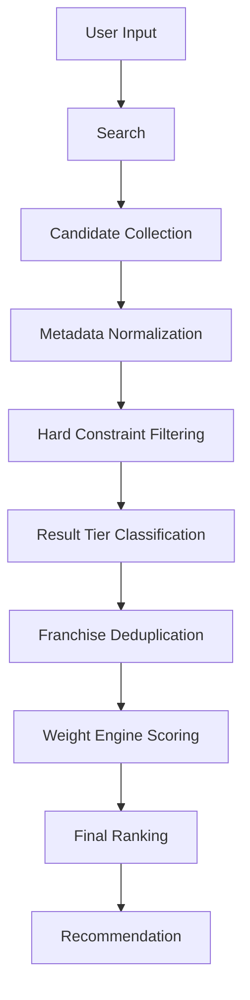
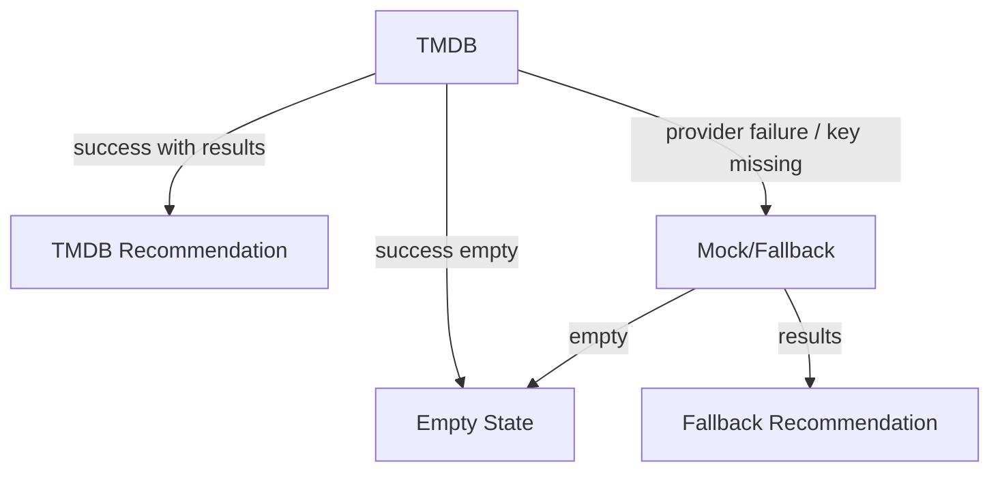

# Recommendation Architecture

Version: 2.3

Author: MYOTT Team

Last Updated: 2026-07-13

Related Sprint: Sprint 9

Breaking Change: No

Decision Log: [DECISION_LOG.md](./DECISION_LOG.md)

Architecture Version: v2.3

Status: ACTIVE

이 문서는 MyOTT Recommendation Engine의 표준 구조를 정의합니다. 목적은 추천을 많이 보여주는 것이 아니라, 사용자가 가장 먼저 볼 작품을 더 빠르고 신뢰 있게 고르도록 추천 품질을 지속적으로 개선하는 것입니다.

---

## Document Versioning

| Field | Meaning |
| --- | --- |
| Version | 문서 구조와 운영 원칙의 변경 이력 |
| Author | 문서 변경 책임 주체 |
| Last Updated | 마지막 검토 또는 변경 일자 |
| Related Sprint | 현재 내용이 연결되는 Sprint |
| Breaking Change | 기존 구현/QA/운영 기준을 다시 검토해야 하는 변경 여부 |
| Decision Log | 중요한 선택과 근거를 남기는 기록 위치 |
| Architecture Version | Recommendation Engine 설계 기준의 안정 버전 |

Version rule:

- Patch: 문구, 링크, 예시처럼 Architecture 의미를 바꾸지 않는 수정
- Minor: Feature, Signal, Weight, QA 기준처럼 확장 가능한 설계 기준 추가
- Major: Recommendation Flow, hard filter, fallback policy처럼 기존 구현 또는 QA 기준을 재검토해야 하는 변경
- Breaking Change가 `Yes`이면 Decision Log에 영향, migration 또는 검토 항목을 남긴다.

---

## 1. Recommendation Vision

MyOTT Recommendation Engine은 사용자의 입력, 선택 옵션, 콘텐츠 metadata, 신뢰 단서를 하나의 설명 가능한 점수 체계로 정리합니다.

핵심 목표:

- 사용자의 취향과 조건을 추천 결과 순서에 실제로 반영한다.
- 추천 기준을 Feature, Signal, Weight, Score로 분리해 지속적으로 조정 가능하게 만든다.
- 추천 이유와 Recommendation Insight를 통해 사용자가 "왜 추천됐는지" 이해하게 한다.
- Founder QA와 실제 사용 관찰을 기반으로 Weight와 Signal 품질을 계속 개선한다.

성공 기준:

> 좋은 추천은 결과 수를 늘리는 것이 아니라 첫 번째 선택의 품질을 높이는 것이다.

---

## 2. Recommendation Flow



| Step | Role | Output |
| --- | --- | --- |
| User Input | 작품명, 콘텐츠 타입, 국가, 장르, 분위기, 런타임, OTT 선택 수집 | Seed / Option |
| Search | seed를 식별하거나 option recommendation 요청을 시작 | Seed / Request Context |
| Candidate Collection | recommendations, similar, country-scoped discover에서 충분한 raw 후보 확보 | Raw Candidate Pool |
| Metadata Normalization | 국가, 장르, 타입, collection metadata를 provider-independent value로 정규화 | Normalized Candidates |
| Hard Constraint Filtering | 콘텐츠 타입과 선택 국가를 primary 후보에 강제 | Eligible Candidates |
| Result Tier Classification | exact와 same-country genre-relaxed 결과를 구분 | Primary Result Tiers |
| Franchise Deduplication | 동일 콘텐츠와 동일 franchise의 최초 결과 과점을 제한 | Diverse Candidates |
| Weight Engine Scoring | 적격 후보 안에서 Signal과 Weight를 계산 | Score Detail |
| Final Ranking | tier, constraint match, score, 신뢰 metadata 순으로 정렬 | Ranked Primary Results |
| Recommendation | Decision Card / Detail Layer에 표시 | User-facing Recommendation |

### Candidate Pipeline Contract

1. Candidate Collection
2. Metadata Normalization
3. Hard Constraint Filtering
4. Result Tier Classification
5. Franchise Deduplication
6. Weight Engine Scoring
7. Final Ranking

`Weight Engine`은 적격 후보의 순위를 정하며, 국가 또는 콘텐츠 타입 hard constraint를 대신하지 않습니다. Raw 후보는 최대 72개까지 수집하고 TMDB 요청은 동시 4개 이하로 제한합니다.

### Candidate Quality Contract

- Primary는 `exact` 후보를 먼저 조립하고 `same-country-relaxed`는 최종 결과의 최대 20%만 허용한다.
- `exact` 후보가 3개 이하이면 장르 완화 후보로 결과 수를 채우지 않는다.
- `country-relaxed` 후보는 Primary에 포함하지 않는다.
- 영화, 드라마, 애니를 함께 요청하면 raw 후보와 최종 exact 후보를 타입별 round-robin으로 구성한다.
- Seed 경로는 입력한 모든 `seedTitles`와 seed genre ID를 최종 Weight Engine에 전달한다.
- Seed recommendations, similar, discover supplement의 출처와 `reasonSeed`는 Detail 보강 뒤에도 보존한다.

### TMDB Request Reliability

Recommendation Action은 [requestContext.js](../../src/lib/providers/tmdb/requestContext.js)의 공유 Request Context를 정확히 하나 사용합니다. Seed 수가 늘어나도 예산은 증가하지 않습니다.

| Guardrail | Limit / Policy |
| --- | --- |
| Total TMDB calls | Recommendation Action당 최대 24회 |
| List calls | Search, Discover, Recommendations, Similar 합계 최대 8회 |
| Detail calls | 최대 16회 |
| Concurrency | 최대 4회 |
| Retry | 429/일시적 5xx/network failure에 최대 2회 |
| Backoff | Retry-After 우선, 아니면 exponential backoff와 jitter |
| Fetch timeout | 개별 외부 요청 최대 8초 |
| Action deadline | 전체 다중 Seed 추천 최대 15초 |
| Retry-After cap | 최대 5초, 남은 Action deadline보다 길게 대기하지 않음 |
| List cache | 7분 best-effort server cache |
| Detail cache | 30분 best-effort server cache |
| Genre metadata cache | 60분 best-effort server cache |

요청 정책:

1. Exact popularity page 1, 기본 vote count 기준
2. Exact vote average page 1, 후보 부족 시 완화된 vote count 기준
3. Exact popularity page 2, 작은 시장의 exact 후보가 부족할 때만
4. TV Thriller semantic provider variant, 해당 필터의 exact 후보가 부족할 때만
5. Same-country genre relaxation, 정확 후보가 있고 부족할 때만

각 단계 뒤 exact 후보 수, 타입별 커버리지, 남은 예산을 확인하고 충분하면 조기 종료합니다. 동일 path와 정규화한 parameter는 in-flight Promise를 공유하며 Cache Hit는 요청 예산을 소비하지 않습니다. 예산이 소진되면 확보한 TMDB 결과만 반환하고 Mock을 섞지 않습니다.

Detail 보강은 목록 metadata로 부적격 후보를 먼저 제거한 뒤 상위 16개 이하에만 수행합니다. runtime, country, genres, collection, watch providers, credits, keywords를 하나의 append response로 가져오며 별도 Watch Provider Detail을 반복 호출하지 않습니다.

### Shared Multi-Seed Recommendation Action

실제 추천 Submit은 `POST /api/recommend/seeds` 한 번으로 모든 Seed를 전달합니다. 기존 `GET /api/search`는 자동완성 및 단일 검색 호환 경로로 유지합니다.

Seed scheduling:

1. Confirmed Seed를 Search 없이 resolved queue에 등록
2. Unconfirmed Seed를 입력 순서대로 Search하되, 해결된 Seed의 Recommendations 예약분을 제외한 List Budget을 다음 Search에 재사용
3. 해결된 고유 작품의 Recommendations를 round-robin으로 수집
4. 전체 후보와 Seed별 대표성이 부족할 때만 Similar
5. Similar 이후에도 부족하고 예산이 남을 때만 Seed Discover Supplement
6. 통합 후보를 한 번만 Detail 보강하고 Candidate Pipeline에서 최종 scoring

고정 Search 개수는 사용하지 않습니다. Search가 unresolved이면 Recommendation 예약을 만들지 않아 남은 List Budget을 뒤의 Seed Search에 재사용합니다. 예산이나 Deadline으로 처리하지 못한 입력은 `deferredSeeds`, 검색을 완료했지만 TMDB Seed를 찾지 못한 입력은 `unresolvedSeeds`, 후보 수집에 기여한 입력은 `processedSeeds`로 구분합니다.

Confirmed Seed request는 `inputTitle`, `tmdbId`, `mediaType`, `resolvedTitle`, `originalTitle`을 전달합니다. UI는 사용자가 입력한 언어와 대소문자를 유지하고, 서버는 확인된 ID로 Search를 생략합니다. 같은 `mediaType + tmdbId`로 해결된 번역 제목은 하나의 내부 작품으로 병합하되 `inputAliases`를 보존합니다.

부분 성공 정책:

- 성공한 TMDB Seed 후보는 유지한다.
- 실패한 Seed 때문에 전체 결과를 Mock으로 교체하지 않는다.
- TMDB 결과와 Mock 결과를 한 배열에 혼합하지 않는다.
- 전체 후보 요청이 실패한 경우에만 API Route가 명시적 Provider fallback을 수행한다.
- Deadline 도달 시 새 요청을 시작하지 않고 이미 확보한 결과를 반환한다.

Diagnostics의 `requestContextCount`는 `1`이며 `aggregateRequestsUsed`는 사후 합산값이 아니라 동일 Context의 `requestsUsed`와 항상 같습니다. Seed별 호출 및 후보 수는 `perSeedRequestCounts`, `perSeedCandidateCounts`로 기록합니다.

Result tier:

| Tier | Meaning | Primary `results` |
| --- | --- | --- |
| `exact` | 국가, 장르, 콘텐츠 타입 일치 | 포함 |
| `same-country-relaxed` | 국가와 타입 일치, 장르만 완화 | exact 다음에 포함 가능 |
| `country-relaxed` | 국가 불일치 또는 미검증 | 포함 금지, `relaxedResults`로 분리 |

각 결과는 `resultTier`, `exactMatch`, `countryMatched`, `genreMatched`, `genreMatchMode`, `semanticGenreMatched`, `semanticGenreReasons`, `contentTypeMatched`, `fallbackStage`, `fallbackRelaxed`를 유지합니다. 기존 API 소비자를 위해 `results` 배열 계약은 유지합니다.

### Seed Discover Supplement

Seed title 경로는 recommendations와 similar를 먼저 수집합니다. 선택 국가와 타입으로 필터한 뒤 후보가 부족하면 seed genre id와 선택 국가를 사용한 Discover로 보충하며, 이 후보는 `seedSupplement`와 `candidateSource`로 직접 연결된 추천과 구분합니다. 외국 작품으로 primary 12개를 강제 충전하지 않습니다.

### Country And Franchise Integrity

- 영화는 `production_countries`, TV는 `origin_country`, 공통 모델은 `countryCodes`를 우선합니다.
- 목록 metadata가 없지만 country-scoped Discover가 적용된 후보는 `provider-filtered`로 표시하고 상세 metadata로 보강합니다.
- 국가 검증 상태는 `verified`, `provider-filtered`, `unknown`, `mismatch`로 구분합니다.
- 동일 TMDB content는 한 번만 유지하고, 공식 collection/series metadata가 있는 동일 franchise는 primary 12에서 최대 1개만 유지합니다.
- 공식 metadata가 없을 때 제목 기반 franchise 추론은 보수적으로 적용합니다.

### Unified Genre Contract

[genreContract.js](../../src/lib/recommendation/genres/genreContract.js)는 Quick Pick, Option Metadata, TMDB Discover, Candidate Pipeline, Weight Engine, Mock Provider, QA Evaluator가 공유하는 장르 Source of Truth입니다.

- `genre-sf`: Movie `878`, TV `10765`
- `genre-sf-fantasy`: Movie `878`과 `14`, TV `10765`
- TMDB TV의 `10765`는 SF와 Fantasy를 결합하므로 `provider-combined`로 기록한다.
- Animation `16`만 있는 작품은 SF exact로 분류하지 않는다.
- TV Thriller는 Crime `80`, Mystery `9648`을 provider exact evidence로 사용한다.
- TV Action & Adventure `10759`는 keyword, mood, overview의 긴장 신호가 함께 있을 때만 `semantic` Thriller로 인정한다.
- Drama `18`만 있는 TV 작품은 Thriller로 인정하지 않는다.

장르 판정 방식은 `provider-exact`, `provider-combined`, `semantic`, `relaxed`로 구분합니다. 사용자에게 provider taxonomy 한계를 기술 ID로 노출하지 않으며, semantic 결과에는 근거 metadata를 보존합니다.

접힌 Quick Pick 장르 상단은 액션, SF, 드라마, 로맨스, 미스터리, 스릴러, 코미디, 공포 순서를 유지합니다. 이 순서는 표시 우선순위이며 추천 Weight를 변경하지 않습니다.

### Seed Coverage And Empty State

API는 `requestedSeedCount`, `uniqueResolvedWorkCount`, `processedSeedCount`, `unresolvedSeedCount`, `deferredSeedCount`, `confirmedSeedCount`, `inputAliasCount`를 반환합니다. UI는 예산이나 내부 상태 용어를 노출하지 않고 실제 반영 작품 수와 미해결 작품 수를 비차단 안내로 표시합니다.

Empty State는 콘텐츠 타입 미선택, 조건 결과 없음, Seed 전체 미해결, 일부 Seed 성공 후 결과 부족, Provider 오류를 분리합니다. 상태 문구는 결과 수와 API metadata를 함께 사용하며, 타입이 선택된 요청에 타입 미선택 안내를 표시하지 않습니다.

---

## 3. Recommendation Feature

Feature는 추천 계산의 원재료입니다. Feature는 표시 언어보다 provider metadata와 locale-independent value를 우선 사용합니다.

| Feature | Definition | Source | Notes |
| --- | --- | --- | --- |
| Title | 입력 작품과 후보 작품의 제목 | User Input / TMDB | seed 식별과 title similarity에 사용 |
| Genre | 장르 id와 표시 장르 | TMDB genre id / Mock tags | scoring은 genre id 우선 |
| Country | 제작 국가 / origin country | TMDB origin_country / Mock country tag | country code 우선 |
| Mood | 사용자가 원하는 감상 분위기 | Quick Pick / inferred tags | 초기에는 rule-based |
| Runtime | 작품 길이 또는 episode runtime | TMDB runtime / episode_run_time | short / medium / long |
| Rating | 평점 | TMDB vote_average | 보조 정렬 |
| Popularity | 인기도 | TMDB popularity | 보조 정렬 |
| Release Year | 공개 연도 | release_date / first_air_date | freshness와 시대성 판단 |
| Keyword | 주요 키워드 | TMDB keywords / Mock keywords | genre보다 세부 취향 |
| Director | 감독 / creator | TMDB credits / created_by | 향후 고급 취향 signal |
| Actor | 주요 출연자 | TMDB credits | 향후 actor affinity |
| Language | 원어 / 시청 언어 | original_language | global recommendation 확장 |
| Franchise | 시리즈 / 세계관 연결 | collection / keyword / manual metadata | 향후 franchise continuity |
| Series | 영화 / TV / animation 여부 | media_type / contentType | content type hard filter |

---

## 4. Recommendation Signal

Signal은 Feature가 추천 판단에 기여하는 방식입니다. Feature는 데이터이고, Signal은 판단입니다.

| Signal | Related Feature | Meaning | Initial Use |
| --- | --- | --- | --- |
| Title Match | Title | 입력 seed를 정확히 찾았는가 | Seed resolution |
| Genre Similarity | Genre | seed와 후보의 genre id가 겹치는가 | Core scoring |
| Country Match | Country | 선택 국가와 후보 origin country가 일치하는가 | Hard filter first |
| Runtime Match | Runtime | 선택한 시청 시간 조건과 맞는가 | Hard/strong scoring |
| Mood Match | Mood | 선택한 분위기와 후보 tags가 맞는가 | Soft scoring |
| Keyword Match | Keyword | seed/candidate keyword가 겹치는가 | v2 scoring |
| Director Match | Director | 같은 감독/creator 취향인가 | Future signal |
| Actor Match | Actor | 선호 배우 연결이 있는가 | Future signal |
| Popularity Balance | Popularity | 너무 낮은 품질 후보를 보정하는가 | Tie-break |
| Rating Confidence | Rating | 일정 평점 이상으로 신뢰감을 주는가 | Trust signal |
| Freshness | Release Year | 최근성 또는 시대 취향을 반영하는가 | v2 scoring |
| Diversity | Type / Genre / Country | 한 종류에 과도하게 몰리지 않는가 | Ranking adjustment |
| Fallback Relaxation | Fallback Stage | 조건을 완화한 후보인가 | Insight + penalty |

---

## 5. Recommendation Weight

초기 Weight는 고정값이 아니라 Sprint별 Founder QA 결과에 따라 조정되는 제품 운영 값입니다.

| Feature Group | Initial Weight | Reason |
| --- | ---: | --- |
| Title / Seed Resolution | 40% | 입력 작품을 정확히 seed로 찾는 것이 추천 품질의 시작점 |
| Genre | 20% | 사용자가 가장 빠르게 이해하는 취향 축 |
| Country | 15% | 선택 옵션이 실제 조건처럼 느껴지는 핵심 축 |
| Mood | 10% | 사용자의 현재 감상 맥락 반영 |
| Runtime | 5% | 시간 제약 반영 |
| Rating | 5% | 신뢰 보조 지표 |
| Popularity | 5% | 결과 품질과 안정성 보조 |

운영 원칙:

- Weight는 코드 상수보다 configuration 또는 engine rule로 분리하는 방향을 목표로 한다.
- Founder QA에서 "상단 결과가 납득 가능한가?"를 기준으로 조정한다.
- 특정 Feature가 결과를 과도하게 지배하면 diversity rule 또는 penalty를 적용한다.
- Country와 Content Type은 사용자가 조건으로 선택한 경우 soft boost가 아니라 hard filter를 우선한다.

Current implementation:

- Weight config: [recommendationWeights.js](../../src/lib/recommendation/scoring/recommendationWeights.js)
- Weight engine: [recommendationWeightEngine.js](../../src/lib/recommendation/scoring/recommendationWeightEngine.js)

Sprint 9의 Weight Engine은 API 호출이 없는 순수 유틸리티입니다. Candidate Pipeline이 hard constraint와 result tier를 확정한 뒤 각 후보에 `scoreDetail`을 생성합니다. 정렬은 result tier와 constraint match를 먼저 보장하고 `finalScore`를 적격 후보 내 순위에 사용합니다. 기존 Recommendation Reason / Insight UI는 유지하며, `scoreDetail`은 향후 Insight와 Debug QA에 연결 가능한 데이터로 둡니다.

---

## 6. Recommendation Scoring

Scoring은 아래 구조를 따른다.

```text
Feature
  -> Signal
  -> Weight
  -> Weighted Signal Score
  -> Final Score
  -> Ranking
```

초기 scoring formula:

```text
Final Score =
  Title/Seed Score
  + Genre Similarity Score
  + Country Match Score
  + Mood Match Score
  + Runtime Match Score
  + Rating Confidence Score
  + Popularity Balance Score
  + Diversity Adjustment
  - Fallback Relaxation Penalty
```

Scoring rule:

- Content Type mismatch는 상위 결과에서 제외한다.
- Country mismatch는 국가가 선택된 primary results에서 제외한다.
- 국가/장르 조합 결과가 부족하면 같은 국가 안에서 장르만 완화한다.
- Fallback으로 보강된 결과는 "조건을 조금 넓혀 함께 추천" signal을 가진다.
- Score는 사용자에게 숫자로 노출하지 않는다.
- 사용자에게는 Recommendation Reason과 Recommendation Insight로 설명한다.

Implementation boundary:

- `calculateRecommendationScore(item, preferences)`는 `finalScore`, `signals`, `weights`, `reasons`, `penalties`를 반환한다.
- 각 Signal은 0~1 사이 normalized value로 계산한다.
- ranking 단계에서는 적격 후보에 `scoreDetail`을 붙이고 result tier, constraint match, `finalScore` 순으로 정렬한다.
- 기존 rule-based score는 `legacyScore`로 보존해 tie-break와 회귀 완충에 사용한다.
- Content Type은 weighted boost가 아니라 hard filter로 유지한다.
- Runtime metadata가 없을 때는 약한 unknown penalty만 적용한다.
- Country fallback 또는 relaxed fallback은 penalty로 기록해 향후 Recommendation Insight와 QA evaluator에 연결할 수 있게 한다.

---

## 7. Recommendation Score

Recommendation Score는 사용자에게 보이는 점수가 아니라 Sprint마다 기록하는 품질 지표입니다.

| Quality Metric | Definition | Review Method |
| --- | --- | --- |
| Relevance | 입력/옵션과 결과가 맞는 정도 | Founder QA dataset |
| Diversity | 결과가 한 작품/장르/국가/타입에 과도하게 몰리지 않는 정도 | Top 12 분포 확인 |
| Explainability | 추천 이유를 3초 안에 이해할 수 있는 정도 | Detail Layer QA |
| Discovery | 이미 아는 작품만 반복하지 않고 새 선택지를 제공하는 정도 | Founder Review |
| Trust | provider, rating, reason, insight가 신뢰감을 주는 정도 | Founder Local QA |
| Founder Satisfaction | Founder가 "이 상태로 보여줄 수 있다"고 판단하는 정도 | Sprint Review |

Sprint 기록 예시:

| Sprint | Relevance | Diversity | Explainability | Discovery | Trust | Founder Satisfaction |
| --- | --- | --- | --- | --- | --- | --- |
| Sprint 9 | Baseline | Baseline | Baseline | Baseline | Baseline | Baseline |
| Sprint 10 | TBD | TBD | TBD | TBD | TBD | TBD |

---

## 8. Recommendation Explainability

Explainability는 추천 신뢰를 만드는 사용자-facing layer입니다.

| Layer | Purpose | Example |
| --- | --- | --- |
| Recommendation Reason | 가장 짧은 1문장 추천 이유 | "김부장을 좋아했다면 추천" |
| Recommendation Insight | 실제 scoring signal을 최대 3개로 설명 | "선택한 국가 조건과 잘 맞습니다." |
| Trust Signal | 선택을 보조하는 metadata 단서 | 장르, 타입, 러닝타임, 평점 |
| Fallback Notice | 조건 완화가 있었음을 투명하게 알림 | "조건을 조금 넓혀 함께 추천합니다." |

원칙:

- 실제 계산에 사용하지 않은 이유는 만들지 않는다.
- Score 숫자는 노출하지 않는다.
- Insight는 Recommendation Reason보다 길거나 중요해 보이면 안 된다.
- 향후 i18n을 위해 logic과 display text를 분리한다.

---

## 9. Recommendation Fallback Strategy

Fallback은 빈 화면을 피하기 위한 장치이지만, 추천 신뢰를 해치면 안 됩니다.



| State | Policy | UI Source |
| --- | --- | --- |
| TMDB success | 실제 TMDB 결과만 표시 | Data Source: TMDB / Fallback: No |
| TMDB empty | Mock으로 자동 보강하지 않음 | Data Source: Empty |
| Explicit fallback | API가 `fallbackUsed: true`를 반환한 경우만 Mock 표시 | Data Source: Fallback / Fallback: Yes |
| Narrow filter fallback | content type과 선택 국가는 유지하고 genre만 완화 | Insight 표시 |
| Error before fallback | 결과 없음 또는 error state | Error / Empty |

Primary fallback order:

1. `exact`: Content Type + Genre + Country
2. `same-country-relaxed`: Content Type + Country, Genre relaxed

`country-relaxed` 후보는 primary `results`에 포함하지 않고 `relaxedResults`로 분리합니다. Content Type과 선택 국가는 절대 완화하지 않으며, 정확한 결과가 12개보다 적더라도 Mock 또는 외국 작품으로 조용히 채우지 않습니다.

---

## 10. Recommendation Test Strategy

대표 QA Dataset은 Sprint마다 유지하고 확장합니다. 각 케이스는 input, expected distribution, fail condition을 함께 기록합니다.

Canonical dataset:

- [recommendation-qa-dataset.json](./recommendation-qa-dataset.json)

Evaluation utility:

- [evaluateRecommendationCase.js](../../src/lib/recommendation/qa/evaluateRecommendationCase.js)

QA runners:

- Deterministic: `pnpm qa:recommendation`
- Unit and pipeline: `pnpm test:recommendation`
- Live TMDB Cold: `pnpm qa:recommendation:live:cold`
- Live TMDB Warm: `pnpm qa:recommendation:live:warm`
- Full local check: `pnpm check`

Live Runner는 실제 Product Provider의 통합 Seed 함수를 사용하며 TMDB credential이 없으면 `SKIP`으로 종료합니다. Cold는 케이스마다 Cache를 비우고, Warm은 같은 케이스를 예열한 뒤 Cache Hit와 외부 호출 감소를 측정합니다. `QA_CASES`로 특정 케이스를 좁혀 볼 수 있습니다. Mock을 Live PASS로 대체하지 않으며 API key는 diagnostics에 포함하지 않습니다.

이 JSON 파일은 Founder 수동 QA와 향후 자동 테스트의 공통 기준 데이터입니다. Architecture 문서는 테스트 전략을 설명하고, 실제 케이스 목록은 dataset 파일에서 관리합니다.

| ID | Input | Expected Result | Fail Condition |
| --- | --- | --- | --- |
| QA-01 | 김부장 + 한국 + 드라마 | 한국 드라마 비중 80% 이상 | 외국 드라마가 상단 대부분 차지 |
| QA-02 | 한국 + 액션 | 한국 액션/범죄/스릴러 영화가 상단 우선 | 미국 액션이 상단 대부분 차지 |
| QA-03 | 일본 + SF | 일본 SF/애니/SF 드라마가 상단 우선 | 일본 외 국가가 상단 대부분 차지 |
| QA-04 | 드라마 + 영국 + 스릴러 | 영국 TV/드라마 스릴러 우선 | 애니/영화가 상단 대부분 차지 |
| QA-05 | 영화 + 일본 + SF | 일본 영화/SF 우선, 애니 편중 방지 | 애니만 12개 노출 |
| QA-06 | 60분 이하 | 짧은 runtime 결과가 우선 | 긴 작품과 결과 차이 없음 |
| QA-07 | 긴 작품 | 긴 runtime 결과가 우선 | short 결과와 차이 없음 |
| QA-08 | TMDB success | 실제 TMDB 결과만 표시 | Mock result 섞임 |
| QA-09 | TMDB empty | Empty State 표시 | Mock 자동 보강 |
| QA-10 | TMDB failure | Explicit fallback 표시 | Fallback: No로 Mock 노출 |

QA 운영 원칙:

- Top 3, Top 6, Top 12를 따로 확인한다.
- 결과 수보다 상단 품질을 우선한다.
- Founder QA에서 FAIL이 나오면 Weight 또는 Signal을 조정한다.
- Provider/API 오류와 Recommendation 품질 문제를 분리해 기록한다.

---

## 11. Recommendation Evolution Roadmap

| Version | Goal | Scope |
| --- | --- | --- |
| v1 | Rule-based Recommendation Engine | Feature/Signal/Weight/Score 구조 정의, hard filter, fallback, explainability |
| v2 | Metadata-aware Scoring | keyword, director, actor, language, freshness, diversity 고도화 |
| v3 | Feedback-aware Recommendation | Founder Log, QA result, manual tuning dataset 반영 |
| v4 | User-aware Recommendation | 로그인/저장 데이터 이후 개인 취향 반영 |
| AI Recommendation | LLM-assisted Explanation and Ranking | AI는 숨겨진 엔진으로 사용하고, 신뢰 가능한 metadata 기반 scoring과 함께 사용 |

AI Recommendation 원칙:

- AI는 추천 근거를 만들어내는 도구가 아니라 계산된 Signal을 더 잘 설명하는 도구로 시작한다.
- 실제 사용자 데이터가 없는 상태에서 "많은 사용자가 좋아함" 같은 문구를 만들지 않는다.
- AI ranking은 rule-based score를 대체하기 전에 Founder QA dataset으로 검증한다.

---

## 12. Architecture Check

- Feature와 Signal은 분리되어 있다.
- Weight는 Founder QA를 통해 조정 가능한 값으로 정의되어 있다.
- Candidate Collection과 Ranking 책임은 분리되어 있다.
- Weight Engine은 hard constraint를 통과한 후보에만 적용된다.
- Primary와 relaxed 결과가 API metadata로 구분된다.
- Recommendation Architecture는 구현의 책임 경계를 정의하는 기준 문서이다.
- Provider fallback과 Recommendation fallback을 구분한다.
- Score는 사용자에게 직접 노출하지 않고 explainability layer를 통해 설명한다.
- Sprint 10 구현은 이 문서를 기준으로 작은 단위로 진행한다.

---

## 13. Global Ready Check

- Genre 판단은 표시 label보다 TMDB genre id를 우선한다.
- Country 판단은 국가명보다 country code를 우선한다.
- Language는 original_language 등 locale-independent value를 우선한다.
- Label과 value를 분리한다.
- i18n 적용 시 Reason/Insight 문구만 교체 가능해야 한다.
- Recommendation logic은 한국어 label에 직접 의존하지 않는다.

---

## 14. Next Implementation Candidates

1. Founder 로컬 Live TMDB QA 결과 이력화
2. keyword/director/actor signal 고도화
3. exact/relaxed user notice 검증
4. Recommendation score logging 자동화

---

## Changelog

### v2.3

- 프런트, Provider, Candidate Pipeline, Weight Engine, Mock, Evaluator가 공유하는 Unified Genre Contract 추가
- Movie SF `878`, Movie SF·Fantasy `878/14`, TV combined `10765` 계약과 provider limitation 명시
- TV Thriller의 provider exact/combined/semantic/relaxed 판정과 근거 metadata 추가
- 작은 시장 exact 후보를 위한 단계별 vote count 및 장르 variant breadth 보강
- Confirmed Seed payload와 사용자 입력 언어 보존, Search 생략 계약 추가
- 고정 Search capacity를 Adaptive Search Budget Recycling으로 교체
- 번역 제목을 동일 TMDB 작품으로 병합하고 모든 입력 Seed 작품을 최종 결과에서 제외
- Seed Coverage 안내와 상태별 Empty State 분류 추가
- Quick Pick 장르 상단 8개 순서를 공통 display priority로 고정
- QA Dataset 31개, evaluator semantic/adaptive/UI metric, 실제 브라우저 경로 검증 추가
- `seeds` 필드는 backward-compatible하게 추가되고 기존 `titles`/`results` 계약을 유지하므로 Breaking Change `No`

### v2.2

- 실제 추천 Submit을 단일 Multi-Seed API와 Shared Request Context로 전환
- Seed Search, Recommendations, Similar, Discover를 phase별 round-robin으로 실행
- Action 단위 24/8/16 예산과 `aggregateRequestsUsed === requestsUsed` 계약 추가
- 개별 Fetch 8초 Timeout, 전체 15초 Deadline, Retry-After 5초 상한 추가
- processed/unresolved/deferred Seed와 Seed별 호출·후보 diagnostics 추가
- 부분 성공 TMDB 결과 보존 및 전체 실패에서만 명시적 Mock fallback 적용
- QA Dataset 24개와 고정 Fetch Fixture 기반 Multi-Seed/Timeout 검증 추가
- Product 경로 기반 Live Cold/Warm Runner 추가
- 기존 API 소비자와 v2.1 hard constraint는 유지하므로 Breaking Change `No`

### v2.1

- Application-level 24/8/16 TMDB Request Budget와 동시 요청 4회 제한 추가
- 요청 단위 deduplication, best-effort TTL cache, 429/일시 오류 retry/backoff 정책 추가
- Progressive Candidate Fetching과 exact 후보 조기 종료 정책 추가
- Primary exact 최소 80%, same-country-relaxed 최대 20% 조립 정책 추가
- 타입별 round-robin raw candidate와 Seed Title final scoring 계약 추가
- Detail/Watch Provider 통합 보강과 최대 16개 Detail 상한 추가
- 20개 QA Dataset, Deterministic Runner, Live TMDB Runner 운영 경로 추가
- v2.0 hard constraint와 API primary/relaxed 계약은 유지하므로 Breaking Change `No`

### v2.0

- Candidate Collection과 Ranking 책임 분리
- 선택 국가를 primary hard constraint로 변경
- `exact`, `same-country-relaxed`, `country-relaxed` result tier 도입
- Seed Discover Supplement와 country metadata validation 정의
- 동일 franchise primary 최대 1개 정책 도입
- Weight Engine 적용 순서를 hard constraint 이후로 변경
- Primary fallback policy 변경으로 Breaking Change 기록

### v1.1

- Recommendation document versioning metadata와 version rule 추가
- Author, Related Sprint, Breaking Change, Decision Log, Architecture Version 기준 명시

### v1.0

- Initial Recommendation Architecture
- Recommendation Flow 정의
- Feature / Signal / Weight / Score 구조 정의
- Fallback Strategy 정의
- QA Dataset 및 Evolution Roadmap 추가
