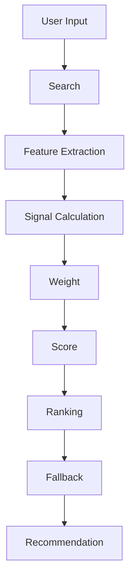
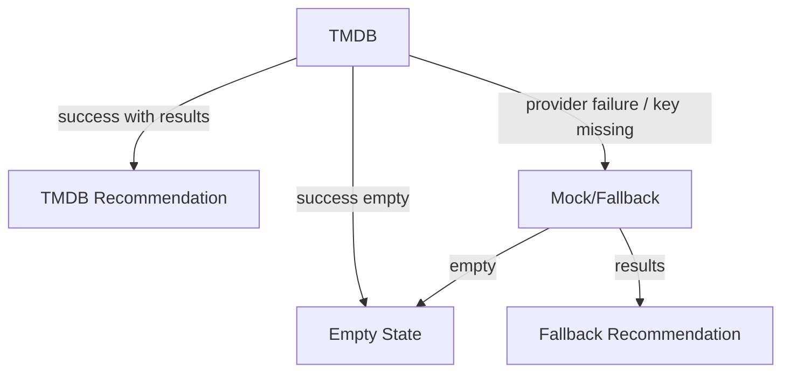

# Recommendation Architecture

Version: 1.0

Last Updated: 2026-07-08

Status: ACTIVE

이 문서는 MyOTT Recommendation Engine의 표준 구조를 정의합니다. 목적은 추천을 많이 보여주는 것이 아니라, 사용자가 가장 먼저 볼 작품을 더 빠르고 신뢰 있게 고르도록 추천 품질을 지속적으로 개선하는 것입니다.

---

## 1. Recommendation Vision

MyOTT Recommendation Engine은 사용자의 입력, 선택 옵션, 콘텐츠 metadata, 신뢰 단서를 하나의 설명 가능한 점수 체계로 정리합니다.

핵심 목표:

- 사용자의 취향과 조건을 추천 결과 순서에 실제로 반영한다.
- 추천 기준을 Feature, Signal, Weight, Score로 분리해 지속적으로 조정 가능하게 만든다.
- 추천 이유와 Recommendation Insight를 통해 사용자가 "왜 추천됐는지" 이해하게 한다.
- Founder QA와 실제 사용 관찰을 기반으로 Weight와 Signal 품질을 계속 개선한다.

성공 기준:

> 좋은 추천은 결과 수를 늘리는 것이 아니라 첫 번째 선택의 품질을 높이는 것이다.

---

## 2. Recommendation Flow



| Step | Role | Output |
| --- | --- | --- |
| User Input | 작품명, 콘텐츠 타입, 국가, 장르, 분위기, 런타임, OTT 선택 수집 | Seed / Option |
| Search | TMDB 또는 fallback provider에서 후보 확보 | Candidate List |
| Feature Extraction | 후보의 metadata를 표준 Feature로 정규화 | Feature Set |
| Signal Calculation | Feature 간 관계를 추천 Signal로 계산 | Signal Map |
| Weight | Signal별 중요도를 적용 | Weighted Signals |
| Score | 최종 추천 점수 산출 | Final Score |
| Ranking | Score와 diversity rule로 정렬 | Ranked Results |
| Fallback | 결과 부족 또는 provider 실패 시 안전한 완화 정책 적용 | Fallback Results |
| Recommendation | Decision Card / Detail Layer에 표시 | User-facing Recommendation |

---

## 3. Recommendation Feature

Feature는 추천 계산의 원재료입니다. Feature는 표시 언어보다 provider metadata와 locale-independent value를 우선 사용합니다.

| Feature | Definition | Source | Notes |
| --- | --- | --- | --- |
| Title | 입력 작품과 후보 작품의 제목 | User Input / TMDB | seed 식별과 title similarity에 사용 |
| Genre | 장르 id와 표시 장르 | TMDB genre id / Mock tags | scoring은 genre id 우선 |
| Country | 제작 국가 / origin country | TMDB origin_country / Mock country tag | country code 우선 |
| Mood | 사용자가 원하는 감상 분위기 | Quick Pick / inferred tags | 초기에는 rule-based |
| Runtime | 작품 길이 또는 episode runtime | TMDB runtime / episode_run_time | short / medium / long |
| Rating | 평점 | TMDB vote_average | 보조 정렬 |
| Popularity | 인기도 | TMDB popularity | 보조 정렬 |
| Release Year | 공개 연도 | release_date / first_air_date | freshness와 시대성 판단 |
| Keyword | 주요 키워드 | TMDB keywords / Mock keywords | genre보다 세부 취향 |
| Director | 감독 / creator | TMDB credits / created_by | 향후 고급 취향 signal |
| Actor | 주요 출연자 | TMDB credits | 향후 actor affinity |
| Language | 원어 / 시청 언어 | original_language | global recommendation 확장 |
| Franchise | 시리즈 / 세계관 연결 | collection / keyword / manual metadata | 향후 franchise continuity |
| Series | 영화 / TV / animation 여부 | media_type / contentType | content type hard filter |

---

## 4. Recommendation Signal

Signal은 Feature가 추천 판단에 기여하는 방식입니다. Feature는 데이터이고, Signal은 판단입니다.

| Signal | Related Feature | Meaning | Initial Use |
| --- | --- | --- | --- |
| Title Match | Title | 입력 seed를 정확히 찾았는가 | Seed resolution |
| Genre Similarity | Genre | seed와 후보의 genre id가 겹치는가 | Core scoring |
| Country Match | Country | 선택 국가와 후보 origin country가 일치하는가 | Hard filter first |
| Runtime Match | Runtime | 선택한 시청 시간 조건과 맞는가 | Hard/strong scoring |
| Mood Match | Mood | 선택한 분위기와 후보 tags가 맞는가 | Soft scoring |
| Keyword Match | Keyword | seed/candidate keyword가 겹치는가 | v2 scoring |
| Director Match | Director | 같은 감독/creator 취향인가 | Future signal |
| Actor Match | Actor | 선호 배우 연결이 있는가 | Future signal |
| Popularity Balance | Popularity | 너무 낮은 품질 후보를 보정하는가 | Tie-break |
| Rating Confidence | Rating | 일정 평점 이상으로 신뢰감을 주는가 | Trust signal |
| Freshness | Release Year | 최근성 또는 시대 취향을 반영하는가 | v2 scoring |
| Diversity | Type / Genre / Country | 한 종류에 과도하게 몰리지 않는가 | Ranking adjustment |
| Fallback Relaxation | Fallback Stage | 조건을 완화한 후보인가 | Insight + penalty |

---

## 5. Recommendation Weight

초기 Weight는 고정값이 아니라 Sprint별 Founder QA 결과에 따라 조정되는 제품 운영 값입니다.

| Feature Group | Initial Weight | Reason |
| --- | ---: | --- |
| Title / Seed Resolution | 40% | 입력 작품을 정확히 seed로 찾는 것이 추천 품질의 시작점 |
| Genre | 20% | 사용자가 가장 빠르게 이해하는 취향 축 |
| Country | 15% | 선택 옵션이 실제 조건처럼 느껴지는 핵심 축 |
| Mood | 10% | 사용자의 현재 감상 맥락 반영 |
| Runtime | 5% | 시간 제약 반영 |
| Rating | 5% | 신뢰 보조 지표 |
| Popularity | 5% | 결과 품질과 안정성 보조 |

운영 원칙:

- Weight는 코드 상수보다 configuration 또는 engine rule로 분리하는 방향을 목표로 한다.
- Founder QA에서 "상단 결과가 납득 가능한가?"를 기준으로 조정한다.
- 특정 Feature가 결과를 과도하게 지배하면 diversity rule 또는 penalty를 적용한다.
- Country와 Content Type은 사용자가 조건으로 선택한 경우 soft boost가 아니라 hard filter를 우선한다.

---

## 6. Recommendation Scoring

Scoring은 아래 구조를 따른다.

```text
Feature
  -> Signal
  -> Weight
  -> Weighted Signal Score
  -> Final Score
  -> Ranking
```

초기 scoring formula:

```text
Final Score =
  Title/Seed Score
  + Genre Similarity Score
  + Country Match Score
  + Mood Match Score
  + Runtime Match Score
  + Rating Confidence Score
  + Popularity Balance Score
  + Diversity Adjustment
  - Fallback Relaxation Penalty
```

Scoring rule:

- Content Type mismatch는 상위 결과에서 제외한다.
- Country mismatch는 선택 국가 결과가 충분할 때 제외한다.
- Genre/Country 조합 결과가 부족할 때만 단계적으로 완화한다.
- Fallback으로 보강된 결과는 "조건을 조금 넓혀 함께 추천" signal을 가진다.
- Score는 사용자에게 숫자로 노출하지 않는다.
- 사용자에게는 Recommendation Reason과 Recommendation Insight로 설명한다.

---

## 7. Recommendation Score

Recommendation Score는 사용자에게 보이는 점수가 아니라 Sprint마다 기록하는 품질 지표입니다.

| Quality Metric | Definition | Review Method |
| --- | --- | --- |
| Relevance | 입력/옵션과 결과가 맞는 정도 | Founder QA dataset |
| Diversity | 결과가 한 작품/장르/국가/타입에 과도하게 몰리지 않는 정도 | Top 12 분포 확인 |
| Explainability | 추천 이유를 3초 안에 이해할 수 있는 정도 | Detail Layer QA |
| Discovery | 이미 아는 작품만 반복하지 않고 새 선택지를 제공하는 정도 | Founder Review |
| Trust | provider, rating, reason, insight가 신뢰감을 주는 정도 | Founder Local QA |
| Founder Satisfaction | Founder가 "이 상태로 보여줄 수 있다"고 판단하는 정도 | Sprint Review |

Sprint 기록 예시:

| Sprint | Relevance | Diversity | Explainability | Discovery | Trust | Founder Satisfaction |
| --- | --- | --- | --- | --- | --- | --- |
| Sprint 9 | Baseline | Baseline | Baseline | Baseline | Baseline | Baseline |
| Sprint 10 | TBD | TBD | TBD | TBD | TBD | TBD |

---

## 8. Recommendation Explainability

Explainability는 추천 신뢰를 만드는 사용자-facing layer입니다.

| Layer | Purpose | Example |
| --- | --- | --- |
| Recommendation Reason | 가장 짧은 1문장 추천 이유 | "김부장을 좋아했다면 추천" |
| Recommendation Insight | 실제 scoring signal을 최대 3개로 설명 | "선택한 국가 조건과 잘 맞습니다." |
| Trust Signal | 선택을 보조하는 metadata 단서 | 장르, 타입, 러닝타임, 평점 |
| Fallback Notice | 조건 완화가 있었음을 투명하게 알림 | "조건을 조금 넓혀 함께 추천합니다." |

원칙:

- 실제 계산에 사용하지 않은 이유는 만들지 않는다.
- Score 숫자는 노출하지 않는다.
- Insight는 Recommendation Reason보다 길거나 중요해 보이면 안 된다.
- 향후 i18n을 위해 logic과 display text를 분리한다.

---

## 9. Recommendation Fallback Strategy

Fallback은 빈 화면을 피하기 위한 장치이지만, 추천 신뢰를 해치면 안 됩니다.



| State | Policy | UI Source |
| --- | --- | --- |
| TMDB success | 실제 TMDB 결과만 표시 | Data Source: TMDB / Fallback: No |
| TMDB empty | Mock으로 자동 보강하지 않음 | Data Source: Empty |
| Explicit fallback | API가 `fallbackUsed: true`를 반환한 경우만 Mock 표시 | Data Source: Fallback / Fallback: Yes |
| Narrow filter fallback | content type은 유지하고 genre/country/runtime 완화 정책을 따름 | Insight 표시 |
| Error before fallback | 결과 없음 또는 error state | Error / Empty |

Fallback relaxation order:

1. Content Type + Genre + Country
2. Content Type + Country
3. Content Type + Genre
4. Content Type only

Content Type은 절대 완화하지 않는다.

---

## 10. Recommendation Test Strategy

대표 QA Dataset은 Sprint마다 유지하고 확장합니다. 각 케이스는 input, expected distribution, fail condition을 함께 기록합니다.

Canonical dataset:

- [recommendation-qa-dataset.json](./recommendation-qa-dataset.json)

Evaluation utility:

- [evaluateRecommendationCase.js](../../src/lib/recommendation/qa/evaluateRecommendationCase.js)

이 JSON 파일은 Founder 수동 QA와 향후 자동 테스트의 공통 기준 데이터입니다. Architecture 문서는 테스트 전략을 설명하고, 실제 케이스 목록은 dataset 파일에서 관리합니다.

| ID | Input | Expected Result | Fail Condition |
| --- | --- | --- | --- |
| QA-01 | 김부장 + 한국 + 드라마 | 한국 드라마 비중 80% 이상 | 외국 드라마가 상단 대부분 차지 |
| QA-02 | 한국 + 액션 | 한국 액션/범죄/스릴러 영화가 상단 우선 | 미국 액션이 상단 대부분 차지 |
| QA-03 | 일본 + SF | 일본 SF/애니/SF 드라마가 상단 우선 | 일본 외 국가가 상단 대부분 차지 |
| QA-04 | 드라마 + 영국 + 스릴러 | 영국 TV/드라마 스릴러 우선 | 애니/영화가 상단 대부분 차지 |
| QA-05 | 영화 + 일본 + SF | 일본 영화/SF 우선, 애니 편중 방지 | 애니만 12개 노출 |
| QA-06 | 60분 이하 | 짧은 runtime 결과가 우선 | 긴 작품과 결과 차이 없음 |
| QA-07 | 긴 작품 | 긴 runtime 결과가 우선 | short 결과와 차이 없음 |
| QA-08 | TMDB success | 실제 TMDB 결과만 표시 | Mock result 섞임 |
| QA-09 | TMDB empty | Empty State 표시 | Mock 자동 보강 |
| QA-10 | TMDB failure | Explicit fallback 표시 | Fallback: No로 Mock 노출 |

QA 운영 원칙:

- Top 3, Top 6, Top 12를 따로 확인한다.
- 결과 수보다 상단 품질을 우선한다.
- Founder QA에서 FAIL이 나오면 Weight 또는 Signal을 조정한다.
- Provider/API 오류와 Recommendation 품질 문제를 분리해 기록한다.

---

## 11. Recommendation Evolution Roadmap

| Version | Goal | Scope |
| --- | --- | --- |
| v1 | Rule-based Recommendation Engine | Feature/Signal/Weight/Score 구조 정의, hard filter, fallback, explainability |
| v2 | Metadata-aware Scoring | keyword, director, actor, language, freshness, diversity 고도화 |
| v3 | Feedback-aware Recommendation | Founder Log, QA result, manual tuning dataset 반영 |
| v4 | User-aware Recommendation | 로그인/저장 데이터 이후 개인 취향 반영 |
| AI Recommendation | LLM-assisted Explanation and Ranking | AI는 숨겨진 엔진으로 사용하고, 신뢰 가능한 metadata 기반 scoring과 함께 사용 |

AI Recommendation 원칙:

- AI는 추천 근거를 만들어내는 도구가 아니라 계산된 Signal을 더 잘 설명하는 도구로 시작한다.
- 실제 사용자 데이터가 없는 상태에서 "많은 사용자가 좋아함" 같은 문구를 만들지 않는다.
- AI ranking은 rule-based score를 대체하기 전에 Founder QA dataset으로 검증한다.

---

## 12. Architecture Check

- Feature와 Signal은 분리되어 있다.
- Weight는 Founder QA를 통해 조정 가능한 값으로 정의되어 있다.
- Recommendation Architecture는 현재 구현과 분리된 기준 문서이다.
- Provider fallback과 Recommendation fallback을 구분한다.
- Score는 사용자에게 직접 노출하지 않고 explainability layer를 통해 설명한다.
- Sprint 10 구현은 이 문서를 기준으로 작은 단위로 진행한다.

---

## 13. Global Ready Check

- Genre 판단은 표시 label보다 TMDB genre id를 우선한다.
- Country 판단은 국가명보다 country code를 우선한다.
- Language는 original_language 등 locale-independent value를 우선한다.
- Label과 value를 분리한다.
- i18n 적용 시 Reason/Insight 문구만 교체 가능해야 한다.
- Recommendation logic은 한국어 label에 직접 의존하지 않는다.

---

## 14. Sprint 10 Implementation Candidates

1. Recommendation Engine module 분리
2. Feature extraction helper 작성
3. Signal calculation helper 작성
4. Weight configuration 작성
5. QA dataset fixture 작성
6. Recommendation score logging 추가
7. Founder QA result 기록 template 추가

---

## Changelog

### v1.0

- Initial Recommendation Architecture
- Recommendation Flow 정의
- Feature / Signal / Weight / Score 구조 정의
- Fallback Strategy 정의
- QA Dataset 및 Evolution Roadmap 추가
